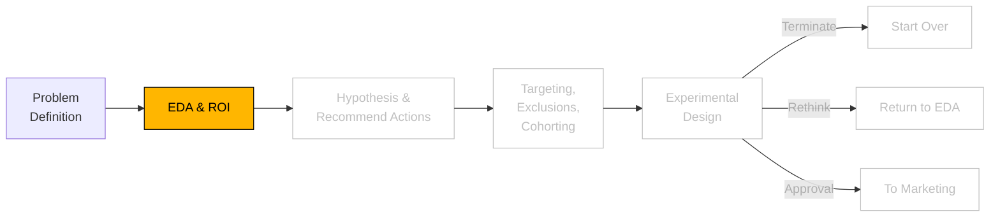

```js
// import some CSS to keep things well styled
import { defaultStyles } from "./components/styles.js";
const styleElement = html`<style>
  ${defaultStyles}
</style>`;
document.head.appendChild(styleElement);
```

```js
import { InteractiveImagingExplorer } from "./components/interactiveimagingexample.js";
import { DistP, distributions } from "./components/DistP.js";
import * as d3 from "https://cdn.jsdelivr.net/npm/d3@7/+esm";
```

```js
// import data gen and consts
import {
  generateHealthcareData,
  CONSTANTS,
  calculateImageUse,
} from "./components/generateHealthcareData.js";
import {
  prepareImagingData,
  stratifiedSubsample,
  getRandomSubsample,
  computeMeanAndCI,
  computeROC,
} from "./components/ml-utils.js";
import { FunnelChart } from "./components/FunnelChart.js";

import {
  createTreeWithStats,
  calculateStats,
  createFunnelData,
  formatNumber,
} from "./components/TreeExplore.js";

import {
  createMulticlassMetric,
  createRateMetric,
  createDemographicMetrics,
  aggregateData,
  createDataSummary,
  createIntMetric,
  createFloatMetric,
} from "./components/AggStats.js";
import { createSankeyFlow } from "./components/SankeyFlow.js";
import { RandomForestClassifier } from "./components/RandomForestClassifier.js";
```

# EDA and ROI

<figure>
<figcaption>Analytics Process</figcaption>



</figure>

Assuming we create an intervention that can divert a fraction of non-preferred imaging to preferred to investigate the magnitude of the opportunity, the savings (in dollars) for converting non-preferred to preferred imaging is displayed to the right of each bar. Savings vary across imaging types, with the highest savings for "MRI" (~$5.625M) and "CT" (~$4.455M), reflecting the cost impact of converting to preferred imaging, even at relatively low levels of behavior change, are significant.

Diving deeper, members with COPD account for a significant portion of non-preferred imaging utilization, with rural regions driving the highest rates, especially among those without primary care engagement (~2x more likely). Smoking status and income bracket show minimal impact compared to chronic conditions like COPD, which drives ~3x more non-preferred imaging utilization than other conditions or no chronic conditions

---

<!--
1. Across all plan types, income brackets, smoking status, members with COPD seem to be driving more non-preferred imaging utilization.

- <strong>${copd_membership}</strong> members are diagnosed with COPD (${copd_frac} of ${total_membership}).
- Among these, <strong> ${copd_non_pref_to_total_imaging_visits} </strong>  (${copd_non_pref_imaging_membership} unique members) visit non-preferred imaging centers.

2.  Rural members drive more non-preferred imaging utilization than suburban and Urban regions, with members with COPD driving ~3x more non-preferred imaging utilization than diabetes, hypertension, and those without a chronic condition.
3.  Members without primary care engagement are ~2x as likely to drive non-preferred imaging utilization than those with a primary care physician.
4.  Smoking status and income bracket do appear to be a significant factor in non-preferred imaging utilization. -->

```js
const percentageDecrease = view(
  Inputs.range([0, 100], {
    step: 1, // Step size for the slider
    format: (x) => x, // Display as percentage
    label: "Percentage Decrease", // Optional: Label for clarity
    value: 5, // Default value
  })
);
```

```js
const updatedImagingVolumes = appendCostData(percentageDecrease);
function prepareUpdatedVolumeData(imagingVolumes, percentageConverted) {
  const volumeData = [];
  Object.entries(imagingVolumes).forEach(([type, data]) => {
    const { annualVolume, preferredShare, totalSavings } = data;

    // Calculate volumes
    const preferredVolume = annualVolume * preferredShare;
    const nonPreferredVolume = annualVolume * (1 - preferredShare);
    const convertedVolume = nonPreferredVolume * (percentageConverted / 100);
    const remainingNonPreferredVolume = nonPreferredVolume - convertedVolume;
    const totalVolume =
      preferredVolume + convertedVolume + remainingNonPreferredVolume;

    // Push the combined data into a single element
    volumeData.push({
      imaging_type: type,
      preferredVolume,
      convertedVolume,
      remainingNonPreferredVolume,
      totalVolume,
      totalSavings, // For text display
    });
  });
  return volumeData;
}
// Prepare updated data for the chart
const updatedVolumeData = prepareUpdatedVolumeData(
  updatedImagingVolumes,
  percentageDecrease
);

// Calculate costs and savings using mean cost data
function calculateTotals(percentageDecrease) {
  const data = [];
  Object.entries(imagingVolumes).forEach(([type, volumeData]) => {
    const { annualVolume, preferredShare } = volumeData;
    const { mean, shape, nonPreferredMultiplier } = imagingSettings[type];

    // Calculate total preferred and non-preferred volumes
    const totalPreferredVolume = annualVolume * preferredShare;
    const totalNonPreferredVolume = annualVolume * (1 - preferredShare);

    // Use the mean cost for preferred and non-preferred
    const preferredCostPerUnit = mean;
    const nonPreferredCostPerUnit =
      preferredCostPerUnit * nonPreferredMultiplier;

    // Calculate total costs
    const totalPreferredCost = totalPreferredVolume * preferredCostPerUnit;
    const totalNonPreferredCost =
      totalNonPreferredVolume * nonPreferredCostPerUnit;

    // Calculate savings per unit and total savings
    const savingsPerUnit = nonPreferredCostPerUnit - preferredCostPerUnit;
    const totalSavings =
      totalNonPreferredVolume * savingsPerUnit * (percentageDecrease / 100);

    // Store results
    data.push({
      imagingType: type,
      totalCost: totalPreferredCost + totalNonPreferredCost,
      totalSavings: totalSavings,
      preferredCostPerUnit,
      nonPreferredCostPerUnit,
    });
  });
  return data;
}

// Append cost data to imagingVolumes
function appendCostData(percentageDecrease) {
  const costData = calculateTotals(percentageDecrease);

  costData.forEach(({ imagingType, totalCost, totalSavings }) => {
    imagingVolumes[imagingType] = {
      ...imagingVolumes[imagingType], // Retain existing properties
      totalCost,
      totalSavings,
    };
  });

  return imagingVolumes;
}

const stackedVolumeData = updatedVolumeData.flatMap((d) => [
  {
    imaging_type: d.imaging_type,
    imaging_preference: "Preferred",
    count: d.preferredVolume,
  },
  {
    imaging_type: d.imaging_type,
    imaging_preference: "Converted",
    count: d.convertedVolume,
  },
  {
    imaging_type: d.imaging_type,
    imaging_preference: "Remaining Non-Preferred",
    count: d.remainingNonPreferredVolume,
  },
]);
// Create stacked bar chart
const updatedVolumeChart = Plot.plot({
  marginLeft: 150,
  marginRight: 150,
  height: 200,
  subtitle: "Imaging Costs and Savings by Imaging Type",
  marks: [
    // Stacked bars for preferred, converted, and non-preferred
    Plot.barX(stackedVolumeData, {
      x: "count",
      y: "imaging_type",
      fill: "imaging_preference",
      sort: { y: "x", reverse: true }, // Sort for better ordering
      title: (d) => `${d.imaging_preference}: ${d.count.toLocaleString()}`,
    }),
    // Text mark for total savings at the total volume's right edge
    Plot.text(
      updatedVolumeData, // Use the combined data for totalVolume and savings
      {
        x: "totalVolume", // Position at total volume
        y: "imaging_type",
        text: (d) => `Savings: $${(d.totalSavings / 100000).toLocaleString()}M`,
        textAnchor: "start", // Align text to the right
        dx: 5, // Slightly offset to the right of the bar
        fill: "black",
      }
    ),
  ],
  color: {
    legend: true,
    domain: ["Preferred", "Converted", "Remaining Non-Preferred"],
    range: ["steelblue", "orange", "red"], // Colors for the bars
  },
  x: {
    label: "Total Volume",
    grid: true,
    tickFormat: "~s", // Format large numbers with SI units
  },
  y: {
    label: "Imaging Type",
    grid: false,
  },
});
//
```

<figure>
  <figcaption>
    <strong>Figure 2:</strong> Stacked Bar Chart of Imaging Costs and Savings by Imaging Type. The chart shows the total volume for each imaging type divided into three categories: "Preferred" (blue), "Converted" (orange), and "Remaining Non-Preferred" (red). The savings (in dollars) for converting non-preferred to preferred imaging is displayed to the right of each bar. 
  </figcaption>

```js
// Display the updated chart
view(updatedVolumeChart);
```

</figure>

---

## How large and valuable is this problem?

### What is the distribution of cost between preferred and non-preferred imaging, by image procedure?

<strong> Figure 1: </strong> shows Non-preferred Imaging Cost Overview. These charts depict the cost distributions for different imaging types, grouped into four categories. Each chart visualizes the cost of "Non-Preferred" imaging (left), the "Savings" achieved by converting to "Preferred" (middle), and the cost of "Preferred" imaging (right). Red dashed lines indicate the average cost savings per imaging type.

```js
// Define the imaging settings with mean and shape
const imagingSettings = {
  "X-Ray": {
    mean: 150, // Average cost in dollars
    shape: 0.8, // Doubled shape for even wider distribution
    nonPreferredMultiplier: 1.45,
    lowerBound: 20, // Lower bound for costs
    upperBound: 400, // Upper bound for costs
  },
  CT: {
    mean: 300,
    shape: 1.0, // Doubled shape
    nonPreferredMultiplier: 1.55,
    lowerBound: 40,
    upperBound: 100,
  },
  MRI: {
    mean: 500,
    shape: 1.2, // Doubled shape
    nonPreferredMultiplier: 1.6,
    lowerBound: 250,
    upperBound: 1000,
  },
  Ultrasound: {
    mean: 100,
    shape: 0.2, // Doubled shape
    nonPreferredMultiplier: 1.35,
    lowerBound: 50,
    upperBound: 500,
  },
  "Nuclear Medicine": {
    mean: 350,
    shape: 0.4, // Doubled shape for broader range
    nonPreferredMultiplier: 1.5,
    lowerBound: 175,
    upperBound: 700,
  },
  Mammography: {
    mean: 200,
    shape: 1.0, // Doubled shape
    nonPreferredMultiplier: 1.4,
    lowerBound: 100,
    upperBound: 400,
  },
  Fluoroscopy: {
    mean: 120,
    shape: 0.8, // Doubled shape
    nonPreferredMultiplier: 1.45,
    lowerBound: 60,
    upperBound: 240,
  },
  "Interventional Radiology": {
    mean: 800,
    shape: 1.6, // Doubled shape for very wide range
    nonPreferredMultiplier: 1.7,
    lowerBound: 400,
    upperBound: 1600,
  },
};
```

```js
// Group definitions - 4 groups of 2
const groupedProcedures = [
  ["Ultrasound", "X-Ray"],
  ["Mammography", "Fluoroscopy"],
  ["Nuclear Medicine", "CT"],
  ["MRI", "Interventional Radiology"],
];

// Categories in order
const categories = ["Non-Preferred", " ", "Preferred"];

// Create distributions and calculate medians
const distributionsMap = {};
const medianValues = {};
// Verify lognormal distribution sampling
Object.entries(imagingSettings).forEach(([imagingType, settings]) => {
  // Create preferred samples using DistP
  const preferredDist = new DistP({
    name: `${imagingType} Lognormal Distribution`,
    distfunc: distributions.lognormal,
    params: { mean: Math.log(settings.mean), shape: settings.shape },
    bounds: [settings.lowerBound, settings.upperBound],
    size: 2000,
    boundMethod: "stack",
  });

  const preferredSamples = preferredDist.samples;

  // Create non-preferred samples by applying the multiplier
  const nonPreferredSamples = preferredSamples.map(
    (value) => value * settings.nonPreferredMultiplier
  );
  // Populate distributionsMap with samples
  distributionsMap[imagingType] = {
    preferred: preferredSamples,
    nonPreferred: nonPreferredSamples,
  };

  // Calculate medians for preferred and non-preferred costs
  medianValues[imagingType] = {
    preferred: d3.median(preferredSamples),
    nonPreferred: d3.median(nonPreferredSamples),
  };
});

// Debug boxPlotData preparation
function prepareTypeData(imagingType) {
  const boxPlotData = [];

  // Add preferred data
  distributionsMap[imagingType].preferred.forEach((value) => {
    if (!isNaN(value)) {
      boxPlotData.push({
        Value: value,
        Category: "Preferred",
      });
    }
  });

  // Add non-preferred data
  distributionsMap[imagingType].nonPreferred.forEach((value) => {
    if (!isNaN(value)) {
      boxPlotData.push({
        Value: value,
        Category: "Non-Preferred",
      });
    }
  });

  // Debug boxPlotData content
  if (boxPlotData.length === 0) {
    console.error(`No boxplot data for ${imagingType}`);
  }

  // Create median line data
  const medianLineData = [
    {
      Category: "Non-Preferred",
      Value: medianValues[imagingType].nonPreferred,
    },
    { Category: "Preferred", Value: medianValues[imagingType].preferred },
  ];

  const midValue =
    (medianValues[imagingType].preferred +
      medianValues[imagingType].nonPreferred) /
    2;
  const savings = Math.round(
    medianValues[imagingType].nonPreferred - medianValues[imagingType].preferred
  );

  // Create arrow data with middle category
  const arrowData = [
    {
      x1: " ",
      y1: midValue,
      x2: " ",
      y2: midValue,
      savings: `$${savings.toLocaleString()}`,
    },
  ];

  return { boxPlotData, medianLineData, arrowData };
}

// Debugging outputs for individual imaging types
groupedProcedures.forEach((group, index) => {
  group.forEach((type) => {
    const data = prepareTypeData(type);
    console.log(`Prepared data for ${type}`, data);
  });
});

// Create plot for a single type
const createTypePlot = (data, title) =>
  Plot.plot({
    subtitle: title,
    marks: [
      Plot.boxY(data.boxPlotData, {
        x: "Category",
        y: "Value",
        fill: "Category",
        stroke: "Category",
      }),
      Plot.line(data.medianLineData, {
        x: "Category",
        y: "Value",
        stroke: "red",
        strokeDasharray: "4,4",
      }),
      Plot.arrow(data.arrowData, {
        x1: "x1",
        y1: "y1",
        x2: "x2",
        y2: "y2",
        dx: 20,
        stroke: "gray",
      }),
      Plot.text(data.arrowData, {
        x: "x2",
        y: "y2",
        text: "savings",
        dx: 0,
        fontSize: 10,
        fill: "black",
        stroke: "white",
        strokeWidth: 3,
      }),
    ],
    y: {
      grid: true,
      label: "Cost ($)",
      tickFormat: "$.0f",
    },
    x: {
      domain: categories, // Specify the order of categories
      label: "",
    },
    color: {
      domain: ["Non-Preferred", "Preferred"], // Only color the box plots
      scheme: "paired",
    },
    width: 300,
    height: 100,
  });

// Create container for a group
const createGroupPlot = (groupTypes, index) => {
  const container = document.createElement("div");
  container.style.display = "flex";
  container.style.gap = "5px";
  container.style.padding = "5px";
  container.style.flexDirection = "column";

  const title = document.createElement("h3");
  title.textContent = "";
  container.appendChild(title);

  const plotsContainer = document.createElement("div");
  plotsContainer.style.display = "flex";
  plotsContainer.style.gap = "5px";

  groupTypes.forEach((type) => {
    const data = prepareTypeData(type);
    const plot = createTypePlot(data, type);
    plotsContainer.appendChild(plot);
  });

  container.appendChild(plotsContainer);
  return container;
};
```

<figure>
<figcaption>
<strong> Figure 1: </strong> Non-preferred Imaging Cost Overview. 
</figcaption>

```js
// Generate and display all groups
groupedProcedures.forEach((group, index) => {
  view(createGroupPlot(group, index));
});
```

</figure>

```js
// Define annual imaging volumes and network distributions
const imagingVolumes = {
  "X-Ray": {
    annualVolume: 250000,
    preferredShare: 0.65,
  },
  CT: {
    annualVolume: 180000,
    preferredShare: 0.7,
  },
  MRI: {
    annualVolume: 150000,
    preferredShare: 0.75,
  },
  Ultrasound: {
    annualVolume: 200000,
    preferredShare: 0.6,
  },
  "Nuclear Medicine": {
    annualVolume: 50000,
    preferredShare: 0.7,
  },
  Mammography: {
    annualVolume: 160000,
    preferredShare: 0.8,
  },
  Fluoroscopy: {
    annualVolume: 70000,
    preferredShare: 0.65,
  },
  "Interventional Radiology": {
    annualVolume: 40000,
    preferredShare: 0.75,
  },
};

// Prepare data for the stacked bar chart
const volumeData = [];
Object.entries(imagingVolumes).forEach(([type, data]) => {
  // Preferred volume
  volumeData.push({
    imaging_type: type,
    imaging_preference: "Preferred",
    count: Math.round(data.annualVolume * data.preferredShare),
  });
  // Non-preferred volume
  volumeData.push({
    imaging_type: type,
    imaging_preference: "Non-Preferred",
    count: Math.round(data.annualVolume * (1 - data.preferredShare)),
  });
});

// Create stacked bar chart
const volumeChart = Plot.plot({
  marginLeft: 150,
  height: 400,
  marks: [
    Plot.barX(volumeData, {
      x: "count",
      y: "imaging_type",
      fill: "imaging_preference",
      sort: { y: "x", reverse: true },
      title: (d) => `${d.imaging_preference}: ${d.count}`,
    }),
  ],
  color: {
    legend: true,
  },
  x: {
    label: "Total Volume",
    grid: true,
  },
  y: {
    label: "",
    grid: false,
  },
});
```

<!-- **How valuable is this problem? What is the theoretical savings impact we 'nudge' members from non-preferred to preferred imaging?** -->

---

```js
const updatedVolumeData = [];
Object.entries(imagingVolumes).forEach(([type, data]) => {
  const preferredVolume = Math.round(data.annualVolume * data.preferredShare);
  const nonPreferredVolume = Math.round(
    data.annualVolume * (1 - data.preferredShare)
  );
  const decreasedVolume = Math.round(
    nonPreferredVolume * (1 - percentageDecrease / 100)
  );

  // Add Preferred and Non-Preferred volumes
  updatedVolumeData.push(
    {
      imaging_type: type,
      imaging_preference: "Preferred",
      count: preferredVolume,
    },
    {
      imaging_type: type,
      imaging_preference: "Non-preferred→preferred converts",
      count: nonPreferredVolume - decreasedVolume,
    } // Subtract decreased volume
  );

  // Add Decreased Volume
  updatedVolumeData.push({
    imaging_type: type,
    imaging_preference: "Non-Preferred",
    count: decreasedVolume,
  });
});
```

<!--
**Do we observe any notable patterns in the data that may lead us to a hypothesis that could inform our engagement and behavior change strategy?** -->

```js
// Generate a dataset for analysis
const DATASETSIZE = 54000;
const data = generateHealthcareData(DATASETSIZE);
```

**Figure 3** shows the percentage of non-preferred imaging visits for different health conditions (COPD, Diabetes, Hypertension, None) categorized by the dimension of choice (e.g., plan type, region, whether or not they're engaged in primary care, smoking status, and income bracket).

<figure>
<figcaption>
<strong> Figure 3</strong>: Distribution of Visit Percentages by plan type, region, whether or not they're engaged in primary care, smoking status, and income bracket.
</figcaption>

```js
// set dimensions for dropdown.
const DIMENSIONS = [
  { value: "PlanType", label: "Plan Type" },
  { value: "Region", label: "Region" },
  { value: "PrimaryCareEngagement", label: "Primary Care Engagement" },
  { value: "SmokingStatus", label: "Smoking Status" },
  { value: "IncomeBracket", label: "Income Bracket" },
];

// Create the dimension selector
const selectedDimension = view(
  Inputs.select(DIMENSIONS, {
    label: "Select Dimension",
    format: (d) => d.label, // Display the label in the dropdown
    value: DIMENSIONS[0], // Default to first option
  })
);
```

```js
// Generate data based on selection
const imageUseData = calculateImageUse(data, selectedDimension.value);

// members with copd (calc)
const copd_membership = data.filter((d) => d.Diagnosis === "COPD").length;

const copd_non_pref_imaging = data
  .filter((d) => d.Diagnosis === "COPD")
  .map((d) => d.NonPreferredVisits)
  .reduce((acc, val) => acc + val, 0);

const copd_non_pref_imaging_membership = data.filter(
  (d) => d.Diagnosis === "COPD" && d.NonPreferredVisits > 0
).length;

const copd_total_imaging = data
  .filter((d) => d.Diagnosis === "COPD")
  .map((d) => d.ImagingVisits)
  .reduce((acc, val) => acc + val, 0);

const total_membership = data.length;
const copd_frac = `${((copd_membership / total_membership) * 100).toFixed(2)}%`;
const copd_non_pref_to_total_imaging_visits = `${(
  (copd_non_pref_imaging / copd_total_imaging) *
  100
).toFixed(2)}%`;

// plot it
view(
  Plot.plot({
    subtitle:
      "Percentage of non-preferred imaging visits by dimensions of interest",
    marginLeft: 10,
    marginRight: 80,
    height: 150,
    x: {
      label: "Percentage of Visits",
      grid: false,
      nice: true,
    },
    y: {
      label: null,
      nice: true,
    },
    color: {
      range: ["#FFB600", "#D04A02"],
      legend: true,
    },
    facet: {
      data: imageUseData,
      marginRight: 30,
      x: selectedDimension.value,
      y: "diagnosis",
      label: "",
      labelAnchor: "middle",
    },
    marks: [
      Plot.barX(imageUseData, {
        x: "value",
        y: "planType",
        fill: "category",
        sort: { y: "-x" },
        fx: selectedDimension.value,
        fy: "diagnosis",
      }),
      Plot.ruleX([0]),
      // Non-preferred text
      Plot.text(
        imageUseData.filter((d) => d.category === "Non-Preferred"),
        {
          x: (d) => 100 - d.value,
          y: "planType",
          text: (d) => `${d.value.toFixed(1)}%`,
          textAnchor: "end",
          dx: -2,
          fill: "white",
          // font: "bold 10px sans-serif",
          fx: selectedDimension.value,
          fy: "diagnosis",
        }
      ),
    ],
  })
);
```

</figure>

---

<strong> Figure 4:</strong> shows a Sankey Diagram of Patient Distribution Across Selected Factors. This diagram visualizes the flow of patient populations across regions, plan types, diagnoses, and smoking statuses based on the selected filters.

<figure>
  <figcaption>
    <strong>Figure 4:</strong> Sankey Diagram of Patient Distribution Across Selected Factors.  
  </figcaption>

```js
const columnMap = {
  Region: "Region",
  PlanType: "PlanType",
  Diagnosis: "Diagnosis",
  SmokingStatus: "SmokingStatus",
  Gender: "Gender",
  IncomeBracket: "IncomeBracket",
  PrimaryCareEngagement: "PrimaryCareEngagement",
};
const columnOrder = view(
  Inputs.checkbox(Object.keys(columnMap), {
    label: "Multi-Select",
    value: ["Region", "PlanType", "Diagnosis", "SmokingStatus"],
  })
);
```

Your selection order: ${Array.from(columnOrder).join(', ')}

```js
// Usage

const stroke_width_divisor = 1000;
const combinedViz = createTreeWithStats(
  data,
  columnOrder,
  columnMap,
  stroke_width_divisor
);
view(combinedViz);
```

</figure>

---

<strong>Table 1</strong> shows Patient Distribution by Path, Gender, and PCP Engagement. The table summarizes key metrics for patient groups stratified by region, plan type, diagnosis, and smoking status. Metrics include total counts, gender distribution, PCP engagement rates, imaging visits, and average age. For instance, among "Rural > C-SNP > COPD > Non-Smoker" patients, 389 individuals have a PCP engagement rate of 74.6% and an average age of 80.5 years.

<figure>

```js
// Define dimensions
const dimensions = ["Region", "PlanType", "Diagnosis", "SmokingStatus"];

// Create Custom
const metrics = [
  ...createMulticlassMetric("Gender", ["Female", "Male"], {
    includeRates: true,
  }),
  ...createRateMetric(
    "PrimaryCareEngagement",
    (row) => row.PrimaryCareEngagement === "Yes",
    { header: "PCP Engagement Rate" }
  ),
  ...createMulticlassMetric("PrimaryCareEngagement", ["Yes", "No"], {
    header: "PCP Engagement",
  }),
  ...createIntMetric("ImagingVisits", {
    header: "Imaging Visits",
    precision: 1,
    weightedAverage: false,
    aggregation: "sum",
  }),
  ...createFloatMetric("Age", {
    header: "Average Age",
    aggregation: "average",
    precision: 1,
  }),
];

// Get results
const results = aggregateData(data, dimensions, metrics);

const headersDict = results.columns.reduce((acc, c) => {
  acc[c.id] = c.name;
  return acc;
}, {});

const table = Inputs.table(results.data, {
  columns: results.columns.map((c) => c.id),
  header: headersDict,
  rows: 18, // Number of rows displayed at once
  maxWidth: 1000, // Maximum width of the table
  multiple: false, // Single row selection
  layout: "auto", // Auto table layout
});

view(table);
```

  <figcaption>
    <strong>Table 1:</strong> Patient Distribution by Path, Gender, and PCP Engagement.
  </figcaption>
</figure>
