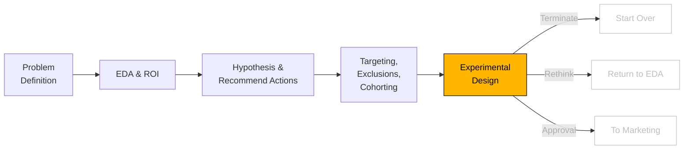

# Experimental Design

```js
// import some CSS to keep things well styled
import { defaultStyles } from "./components/styles.js";
const styleElement = html`<style>
  ${defaultStyles}
</style>`;
document.head.appendChild(styleElement);
```

```js
// import data gen and consts
import {
  generateHealthcareData,
  CONSTANTS,
  calculateImageUse,
} from "./components/generateHealthcareData.js";
import {
  prepareImagingData,
  stratifiedSubsample,
  getRandomSubsample,
  computeMeanAndCI,
  computeROC,
} from "./components/ml-utils.js";
import { require } from "d3-require";
import { FunnelChart } from "./components/FunnelChart.js";

import {
  createTreeWithStats,
  calculateStats,
  createFunnelData,
  formatNumber,
} from "./components/TreeExplore.js";
import {
  createMulticlassMetric,
  createRateMetric,
  createDemographicMetrics,
  aggregateData,
  createDataSummary,
  createIntMetric,
  createFloatMetric,
} from "./components/AggStats.js";
import { createSankeyFlow } from "./components/SankeyFlow.js";
import { RandomForestClassifier } from "./components/RandomForestClassifier.js";
```

```js
import {
  calculateSampleSizeForMeans,
  calculateSampleSizeForProportions,
  calculateVarianceFormulaIndividualRandomized,
  calculateVarianceFormulaClusterRandomized,
  generateVarianceData,
  generateUnifiedVarianceData,
} from "./components/parallelmethods.js";
```

```js
import * as d3 from "https://cdn.jsdelivr.net/npm/d3@7/+esm";
import * as numeric from "https://cdnjs.cloudflare.com/ajax/libs/numeric/1.2.6/numeric.min.js";
import { require } from "d3-require";
const jStat = await require("jstat@1.9.4");
```



## Experimentation

Now that we know where the opportunity lays, let's run an experiment to evaluate three design variations: a control (A), an alternative (AA), and an intervention (B). The goal is to measure user preference and identify the most effective design. To ensure valid results, the experiment must be properly sized, considering statistical power and expected effect sizes, to minimize risks of false positives or negatives.

After sizing and conducting the experiment, the results are summarized in the figure. The outcomes indicate the distribution of user preferences ("Preferred" vs. "Non-Preferred") for each design. This data provides actionable insights into how the designs perform relative to each other, guiding decision-making for future implementations.

**Question:** How many people would we need to observe a relative decrease in non-preferred imaging utilizaitoni with a given statistical certainty?

**Answer:**

Let's use this equation to calculate:

```js
const equation_2 = tex.block` n = \frac{(z_{1-\alpha/2} + z_{\beta})^2 [p_1 (1 - p_1) + p_2 (1 - p_2)]}{(p_1 - p_2)^2} `;

view(equation_2);
```

```js
view(equation_2);
```

```js
const Example1Form = Inputs.form({
  z_alpha_2_proportions: Inputs.range([0, 5], {
    value: 1.96,
    step: 0.01,
    label: tex`Z_{1-\alpha/2}`,
  }),
  z_beta_proportions: Inputs.range([0, 5], {
    value: 0.84,
    step: 0.01,
    label: tex`Z_\beta`,
  }),
  p1_proportions: Inputs.range([0, 1], {
    value: 0.22,
    step: 0.01,
    label: tex`p_1`,
  }),

  relative_increase: Inputs.range([-1, 1], {
    value: 0.1,
    step: 0.01,
    label: tex`R_{relative~change}`,
  }),
});
view(Example1Form);
```

```js
const relative_p2_calc =
  Example1Form_Selections.p1_proportions *
  (1 + Example1Form_Selections.relative_increase);
const p2_proportions_r = Inputs.range([0, 1], {
  value: relative_p2_calc,
  step: 0.01,
  label: tex`p_2`,
  disabled: true,
});
view(p2_proportions_r);
```

```js
const Example1Form_Selections = Generators.input(Example1Form);
```

```js
const n_proportions_wand = calculateSampleSizeForProportions(
  Example1Form_Selections.z_alpha_2_proportions,
  Example1Form_Selections.z_beta_proportions,
  Example1Form_Selections.p1_proportions,
  relative_p2_calc
);
```

<!-- prettier-ignore -->
You would need: <strong>${n_proportions_wand} participants in each arm </strong> to observe a relative shift of <b>${Example1Form_Selections.relative_increase*100}%</b> in enrollment rate (i.e., a p1 of ${Example1Form_Selections.p1_proportions*100}% and a p2 of ${relative_p2_calc.toFixed(2)*100}%). Note that the relative increase is a common framing, but one that is somewhat mathematically confusing.

<figure>
<figcaption> <strong> Figure X</strong>: This figure illustrates the outcomes of an A/B/A test comparing the "control" (A), an alternative design (AA), and an intervention design (B). The figure shows the distribution of participants between "Preferred" and "Non-Preferred" outcomes for each design, along with their respective percentages. Key observations include:

</figcaption>

```js
const sankeydata = {
  root: {
    control: {
      // Group without intervention
      a: { preferred: (5751.0 / 3) * 2, non_preferred: (5751.0 / 3) * 1 },
    },
    treatment: {
      // Group with intervention
      b: { preferred: (5751.0 / 3) * 2.5, non_preferred: (5751.0 / 3) * 0.5 },
    },
  },
};

const config = {
  width: 800,
  height: 150,
  particleSize: 3,
  particleSpeed: 5,
  particleSpawnRate: 2,
  particleVerticalSpread: 0.8,
  hideRootLabel: true,
  counterSpacing: 100,
  nodePadding: 50,
  margin: { top: 20, right: 250, bottom: 20, left: -20 },
  bucketColors: {
    preferred: "#FFB600",
    non_preferred: "#D04A02",
  },
};

const replay = view(Inputs.button("Replay"));
const { node, replay: replayFn } = createSankeyFlow(sankeydata, config);
view(node);
```

```js
replay; // This will trigger the replay when the button is clickeds
replayFn();
```

</figure>
