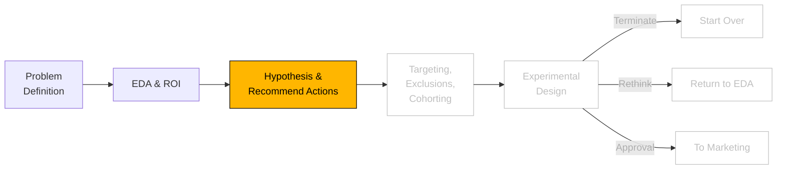

```js
// import some CSS to keep things well styled
import { defaultStyles } from "./components/styles.js";
const styleElement = html`<style>
  ${defaultStyles}
</style>`;
document.head.appendChild(styleElement);
```

```js
import { InteractiveImagingExplorer } from "./components/interactiveimagingexample.js";
import { DistP, distributions } from "./components/DistP.js";
import * as d3 from "https://cdn.jsdelivr.net/npm/d3@7/+esm";
import { generateImagingBusinessCase } from "./components/imagingbusinesscase.js";
```

```js
// import data gen and consts
import {
  generateHealthcareData,
  CONSTANTS,
  calculateImageUse,
} from "./components/generateHealthcareData.js";
import {
  prepareImagingData,
  stratifiedSubsample,
  getRandomSubsample,
  computeMeanAndCI,
  computeROC,
} from "./components/ml-utils.js";
import { FunnelChart } from "./components/FunnelChart.js";

import {
  createTreeWithStats,
  calculateStats,
  createFunnelData,
  formatNumber,
} from "./components/TreeExplore.js";

import {
  createMulticlassMetric,
  createRateMetric,
  createDemographicMetrics,
  aggregateData,
  createDataSummary,
  createIntMetric,
  createFloatMetric,
} from "./components/AggStats.js";
import { createSankeyFlow } from "./components/SankeyFlow.js";
import { RandomForestClassifier } from "./components/RandomForestClassifier.js";
```

# Hypotheses and Actions

<figure>
<figcaption>Analytics Process</figcaption>



</figure>

---

## Hypothesis 1: **Clinical Opportunity for COPD Patients**

**Hypothesis**: COPD patients aged 55+ are receiving imaging at non-preferred locations due to low primary care engagement or limited access to preferred imaging centers in rural areas.

1. **Improve Primary Care Engagement**:

   - **Behavior Change Principle**: Leverage **Social Norms and Personalization**.
   - **Justification**: Studies show that proactive primary care engagement improves adherence to preferred providers by emphasizing personalized health plans and trusted physician recommendations.
   - **Channels**: Outreach via primary care providers (PCPs), digital patient portals, automated SMS reminders.
   - **Incremental Work**:
     - PCP education to promote the benefits of preferred imaging.
     - Integrate outreach campaigns into existing digital health management systems.
   - **Behavior Change Estimate**: A 10–15% reduction in non-preferred imaging utilization via PCP-led engagement campaigns.

2. **Enhance Access to Preferred Imaging Centers**:
   - **Behavior Change Principle**: **Reducing Friction**.
   - **Justification**: Providing transportation assistance and co-pay incentives addresses logistical barriers, a critical factor for rural populations.
   - **Channels**: Direct mail with vouchers, community outreach programs, ride-sharing partnerships (e.g., Lyft Healthcare).
   - **Incremental Work**:
     - Establish agreements with ride-sharing providers.
     - Develop an incentive structure for co-pay reductions or waived fees.
   - **Behavior Change Estimate**: A 5–10% reduction in non-preferred imaging utilization among rural COPD patients.

```js
const percentageDecreaseHyp1 = view(
  Inputs.range([0, 100], {
    step: 1,
    label: "Percentage Decrease",
    value: 5,
  })
);

// Generate and display results
const results = generateImagingBusinessCase(percentageDecreaseHyp1);
view(results.chart);

view(results);
```

---

## Hypothesis 2: **Addressing Geographic and Economic Barriers**

**Hypothesis**: Rural geography and low-income brackets exacerbate non-preferred imaging utilization due to limited access and misinformation.

1. **Educational Campaigns for Preferred Imaging**:

   - **Behavior Change Principle**: Use **Cognitive Ease and Simplification**.
   - **Justification**: Educational materials tailored to specific demographics (low literacy, older age) increase understanding of preferred imaging benefits, as shown in behavior change studies for preventive care.
   - **Channels**: Social media ads (e.g., Facebook for rural areas), local community newsletters, and in-clinic handouts.
   - **Incremental Work**:
     - Develop region-specific, culturally relevant educational materials.
     - Partner with rural clinics to distribute educational content.
   - **Behavior Change Estimate**: A 7–12% increase in preferred imaging use through education-based interventions.

2. **Preferred Imaging Center Incentives**:
   - **Behavior Change Principle**: **Loss Aversion and Immediate Rewards**.
   - **Justification**: Offering immediate rewards, such as waived co-pays for using preferred centers, motivates members to change behavior by emphasizing immediate financial benefits.
   - **Channels**: Payer-provided co-pay vouchers via app notifications, physical mailers, or in-clinic visits.
   - **Incremental Work**:
     - Coordinate with imaging providers to implement co-pay reduction programs.
     - Integrate voucher systems into payer apps and member accounts.
   - **Behavior Change Estimate**: A 10–15% reduction in non-preferred imaging utilization in targeted rural regions.

---

## Hypothesis 3: **Targeting Non-Engaged Smokers**

**Hypothesis**: Members with low primary care engagement and smoking history are more likely to drive non-preferred imaging utilization due to fragmented care and lack of proactive outreach.

1. **Smoking Cessation Linked to Imaging Preferences**:

   - **Behavior Change Principle**: **Bundling Behaviors**.
   - **Justification**: Bundling smoking cessation programs with preferred imaging education has been shown to drive health behavior changes in smokers.
   - **Channels**: Integrated payer apps offering bundled programs, phone-based coaching, or in-person workshops.
   - **Incremental Work**:
     - Bundle smoking cessation programs with imaging-specific education in existing apps.
     - Train coaches or PCPs to emphasize imaging-related outcomes during smoking interventions.
   - **Behavior Change Estimate**: A 5–8% increase in preferred imaging utilization through behavior bundling.

2. **Incentivized Health Checks for Smokers**:
   - **Behavior Change Principle**: **Positive Reinforcement and Goal Setting**.
   - **Justification**: Incentivizing annual health checks has been shown to increase adherence to preventive care recommendations, including preferred imaging use.
   - **Channels**: Monetary incentives through payer platforms, health check reward programs tied to PCP visits, digital nudges.
   - **Incremental Work**:
     - Build incentive tracking into payer member portals.
     - Partner with PCPs to ensure targeted outreach.
   - **Behavior Change Estimate**: A 10–12% reduction in non-preferred imaging utilization among smokers.

---

These recommended actions combine **evidence-based behavior change principles** with practical payer-driven interventions, designed to address the root causes of non-preferred imaging utilization while providing measurable outcomes.

<!--
1. Across all plan types, income brackets, smoking status, members with COPD seem to be driving more non-preferred imaging utilization.

- <strong>${copd_membership}</strong> members are diagnosed with COPD (${copd_frac} of ${total_membership}).
- Among these, <strong> ${copd_non_pref_to_total_imaging_visits} </strong>  (${copd_non_pref_imaging_membership} unique members) visit non-preferred imaging centers.

2.  Rural members drive more non-preferred imaging utilization than suburban and Urban regions, with members with COPD driving ~3x more non-preferred imaging utilization than diabetes, hypertension, and those without a chronic condition.
3.  Members without primary care engagement are ~2x as likely to drive non-preferred imaging utilization than those with a primary care physician.
4.  Smoking status and income bracket do appear to be a significant factor in non-preferred imaging utilization. -->

```js
const percentageDecrease = view(
  Inputs.range([0, 100], {
    step: 1, // Step size for the slider
    format: (x) => x, // Display as percentage
    label: "Percentage Decrease", // Optional: Label for clarity
    value: 5, // Default value
  })
);
```

```js
const updatedImagingVolumes = appendCostData(percentageDecrease);
function prepareUpdatedVolumeData(imagingVolumes, percentageConverted) {
  const volumeData = [];
  Object.entries(imagingVolumes).forEach(([type, data]) => {
    const { annualVolume, preferredShare, totalSavings } = data;

    // Calculate volumes
    const preferredVolume = annualVolume * preferredShare;
    const nonPreferredVolume = annualVolume * (1 - preferredShare);
    const convertedVolume = nonPreferredVolume * (percentageConverted / 100);
    const remainingNonPreferredVolume = nonPreferredVolume - convertedVolume;
    const totalVolume =
      preferredVolume + convertedVolume + remainingNonPreferredVolume;

    // Push the combined data into a single element
    volumeData.push({
      imaging_type: type,
      preferredVolume,
      convertedVolume,
      remainingNonPreferredVolume,
      totalVolume,
      totalSavings, // For text display
    });
  });
  return volumeData;
}
// Prepare updated data for the chart
const updatedVolumeData = prepareUpdatedVolumeData(
  updatedImagingVolumes,
  percentageDecrease
);

// Calculate costs and savings using mean cost data
function calculateTotals(percentageDecrease) {
  const data = [];
  Object.entries(imagingVolumes).forEach(([type, volumeData]) => {
    const { annualVolume, preferredShare } = volumeData;
    const { mean, shape, nonPreferredMultiplier } = imagingSettings[type];

    // Calculate total preferred and non-preferred volumes
    const totalPreferredVolume = annualVolume * preferredShare;
    const totalNonPreferredVolume = annualVolume * (1 - preferredShare);

    // Use the mean cost for preferred and non-preferred
    const preferredCostPerUnit = mean;
    const nonPreferredCostPerUnit =
      preferredCostPerUnit * nonPreferredMultiplier;

    // Calculate total costs
    const totalPreferredCost = totalPreferredVolume * preferredCostPerUnit;
    const totalNonPreferredCost =
      totalNonPreferredVolume * nonPreferredCostPerUnit;

    // Calculate savings per unit and total savings
    const savingsPerUnit = nonPreferredCostPerUnit - preferredCostPerUnit;
    const totalSavings =
      totalNonPreferredVolume * savingsPerUnit * (percentageDecrease / 100);

    // Store results
    data.push({
      imagingType: type,
      totalCost: totalPreferredCost + totalNonPreferredCost,
      totalSavings: totalSavings,
      preferredCostPerUnit,
      nonPreferredCostPerUnit,
    });
  });
  return data;
}

// Append cost data to imagingVolumes
function appendCostData(percentageDecrease) {
  const costData = calculateTotals(percentageDecrease);

  costData.forEach(({ imagingType, totalCost, totalSavings }) => {
    imagingVolumes[imagingType] = {
      ...imagingVolumes[imagingType], // Retain existing properties
      totalCost,
      totalSavings,
    };
  });

  return imagingVolumes;
}

const stackedVolumeData = updatedVolumeData.flatMap((d) => [
  {
    imaging_type: d.imaging_type,
    imaging_preference: "Preferred",
    count: d.preferredVolume,
  },
  {
    imaging_type: d.imaging_type,
    imaging_preference: "Converted",
    count: d.convertedVolume,
  },
  {
    imaging_type: d.imaging_type,
    imaging_preference: "Remaining Non-Preferred",
    count: d.remainingNonPreferredVolume,
  },
]);
// Create stacked bar chart
const updatedVolumeChart = Plot.plot({
  marginLeft: 150,
  marginRight: 150,
  height: 200,
  subtitle: "Imaging Costs and Savings by Imaging Type",
  marks: [
    // Stacked bars for preferred, converted, and non-preferred
    Plot.barX(stackedVolumeData, {
      x: "count",
      y: "imaging_type",
      fill: "imaging_preference",
      sort: { y: "x", reverse: true }, // Sort for better ordering
      title: (d) => `${d.imaging_preference}: ${d.count.toLocaleString()}`,
    }),
    // Text mark for total savings at the total volume's right edge
    Plot.text(
      updatedVolumeData, // Use the combined data for totalVolume and savings
      {
        x: "totalVolume", // Position at total volume
        y: "imaging_type",
        text: (d) => `Savings: $${(d.totalSavings / 100000).toLocaleString()}M`,
        textAnchor: "start", // Align text to the right
        dx: 5, // Slightly offset to the right of the bar
        fill: "black",
      }
    ),
  ],
  color: {
    legend: true,
    domain: ["Preferred", "Converted", "Remaining Non-Preferred"],
    range: ["steelblue", "orange", "red"], // Colors for the bars
  },
  x: {
    label: "Total Volume",
    grid: true,
    tickFormat: "~s", // Format large numbers with SI units
  },
  y: {
    label: "Imaging Type",
    grid: false,
  },
});
//
```

<figure>
  <figcaption>
    <strong>Figure 2:</strong> Stacked Bar Chart of Imaging Costs and Savings by Imaging Type. The chart shows the total volume for each imaging type divided into three categories: "Preferred" (blue), "Converted" (orange), and "Remaining Non-Preferred" (red). The savings (in dollars) for converting non-preferred to preferred imaging is displayed to the right of each bar. 
  </figcaption>

```js
// Display the updated chart
view(updatedVolumeChart);
```

</figure>

```js
// Define the imaging settings with mean and shape
const imagingSettings = {
  "X-Ray": {
    mean: 150, // Average cost in dollars
    shape: 0.8, // Doubled shape for even wider distribution
    nonPreferredMultiplier: 1.45,
    lowerBound: 20, // Lower bound for costs
    upperBound: 400, // Upper bound for costs
  },
  CT: {
    mean: 300,
    shape: 1.0, // Doubled shape
    nonPreferredMultiplier: 1.55,
    lowerBound: 40,
    upperBound: 100,
  },
  MRI: {
    mean: 500,
    shape: 1.2, // Doubled shape
    nonPreferredMultiplier: 1.6,
    lowerBound: 250,
    upperBound: 1000,
  },
  Ultrasound: {
    mean: 100,
    shape: 0.2, // Doubled shape
    nonPreferredMultiplier: 1.35,
    lowerBound: 50,
    upperBound: 500,
  },
  "Nuclear Medicine": {
    mean: 350,
    shape: 0.4, // Doubled shape for broader range
    nonPreferredMultiplier: 1.5,
    lowerBound: 175,
    upperBound: 700,
  },
  Mammography: {
    mean: 200,
    shape: 1.0, // Doubled shape
    nonPreferredMultiplier: 1.4,
    lowerBound: 100,
    upperBound: 400,
  },
  Fluoroscopy: {
    mean: 120,
    shape: 0.8, // Doubled shape
    nonPreferredMultiplier: 1.45,
    lowerBound: 60,
    upperBound: 240,
  },
  "Interventional Radiology": {
    mean: 800,
    shape: 1.6, // Doubled shape for very wide range
    nonPreferredMultiplier: 1.7,
    lowerBound: 400,
    upperBound: 1600,
  },
};
```

```js
// Group definitions - 4 groups of 2
const groupedProcedures = [
  ["Ultrasound", "X-Ray"],
  ["Mammography", "Fluoroscopy"],
  ["Nuclear Medicine", "CT"],
  ["MRI", "Interventional Radiology"],
];

// Categories in order
const categories = ["Non-Preferred", "Savings", "Preferred"];

// Create distributions and calculate medians
const distributionsMap = {};
const medianValues = {};
// Verify lognormal distribution sampling
Object.entries(imagingSettings).forEach(([imagingType, settings]) => {
  // Create preferred samples using DistP
  const preferredDist = new DistP({
    name: `${imagingType} Lognormal Distribution`,
    distfunc: distributions.lognormal,
    params: { mean: Math.log(settings.mean), shape: settings.shape },
    bounds: [settings.lowerBound, settings.upperBound],
    size: 2000,
    boundMethod: "stack",
  });

  const preferredSamples = preferredDist.samples;

  // Create non-preferred samples by applying the multiplier
  const nonPreferredSamples = preferredSamples.map(
    (value) => value * settings.nonPreferredMultiplier
  );
  // Populate distributionsMap with samples
  distributionsMap[imagingType] = {
    preferred: preferredSamples,
    nonPreferred: nonPreferredSamples,
  };

  // Calculate medians for preferred and non-preferred costs
  medianValues[imagingType] = {
    preferred: d3.median(preferredSamples),
    nonPreferred: d3.median(nonPreferredSamples),
  };
});

// Debug boxPlotData preparation
function prepareTypeData(imagingType) {
  const boxPlotData = [];

  // Add preferred data
  distributionsMap[imagingType].preferred.forEach((value) => {
    if (!isNaN(value)) {
      boxPlotData.push({
        Value: value,
        Category: "Preferred",
      });
    }
  });

  // Add non-preferred data
  distributionsMap[imagingType].nonPreferred.forEach((value) => {
    if (!isNaN(value)) {
      boxPlotData.push({
        Value: value,
        Category: "Non-Preferred",
      });
    }
  });

  // Debug boxPlotData content
  if (boxPlotData.length === 0) {
    console.error(`No boxplot data for ${imagingType}`);
  }

  // Create median line data
  const medianLineData = [
    {
      Category: "Non-Preferred",
      Value: medianValues[imagingType].nonPreferred,
    },
    { Category: "Preferred", Value: medianValues[imagingType].preferred },
  ];

  const midValue =
    (medianValues[imagingType].preferred +
      medianValues[imagingType].nonPreferred) /
    2;
  const savings = Math.round(
    medianValues[imagingType].nonPreferred - medianValues[imagingType].preferred
  );

  // Create arrow data with middle category
  const arrowData = [
    {
      x1: "Savings",
      y1: midValue,
      x2: "Savings",
      y2: midValue,
      savings: `$${savings.toLocaleString()}`,
    },
  ];

  return { boxPlotData, medianLineData, arrowData };
}

// Debugging outputs for individual imaging types
groupedProcedures.forEach((group, index) => {
  group.forEach((type) => {
    const data = prepareTypeData(type);
    console.log(`Prepared data for ${type}`, data);
  });
});

// Create plot for a single type
const createTypePlot = (data, title) =>
  Plot.plot({
    subtitle: title,
    marks: [
      Plot.boxY(data.boxPlotData, {
        x: "Category",
        y: "Value",
        fill: "Category",
        stroke: "Category",
      }),
      Plot.line(data.medianLineData, {
        x: "Category",
        y: "Value",
        stroke: "red",
        strokeDasharray: "4,4",
      }),
      Plot.arrow(data.arrowData, {
        x1: "x1",
        y1: "y1",
        x2: "x2",
        y2: "y2",
        dx: 20,
        stroke: "gray",
      }),
      Plot.text(data.arrowData, {
        x: "x2",
        y: "y2",
        text: "savings",
        dx: 40,
        fontSize: 10,
      }),
    ],
    y: {
      grid: true,
      label: "Cost ($)",
      tickFormat: "$.0f",
    },
    x: {
      domain: categories, // Specify the order of categories
      label: "Cost Category",
    },
    color: {
      domain: ["Non-Preferred", "Preferred"], // Only color the box plots
      scheme: "paired",
    },
    width: 300,
    height: 200,
  });

// Create container for a group
const createGroupPlot = (groupTypes, index) => {
  const container = document.createElement("div");
  container.style.display = "flex";
  container.style.gap = "5px";
  container.style.padding = "5px";
  container.style.flexDirection = "column";

  const title = document.createElement("h3");
  title.textContent = "";
  container.appendChild(title);

  const plotsContainer = document.createElement("div");
  plotsContainer.style.display = "flex";
  plotsContainer.style.gap = "5px";

  groupTypes.forEach((type) => {
    const data = prepareTypeData(type);
    const plot = createTypePlot(data, type);
    plotsContainer.appendChild(plot);
  });

  container.appendChild(plotsContainer);
  return container;
};
```

```js
// Define annual imaging volumes and network distributions
const imagingVolumes = {
  "X-Ray": {
    annualVolume: 250000,
    preferredShare: 0.65,
  },
  CT: {
    annualVolume: 180000,
    preferredShare: 0.7,
  },
  MRI: {
    annualVolume: 150000,
    preferredShare: 0.75,
  },
  Ultrasound: {
    annualVolume: 200000,
    preferredShare: 0.6,
  },
  "Nuclear Medicine": {
    annualVolume: 50000,
    preferredShare: 0.7,
  },
  Mammography: {
    annualVolume: 160000,
    preferredShare: 0.8,
  },
  Fluoroscopy: {
    annualVolume: 70000,
    preferredShare: 0.65,
  },
  "Interventional Radiology": {
    annualVolume: 40000,
    preferredShare: 0.75,
  },
};

// Prepare data for the stacked bar chart
const volumeData = [];
Object.entries(imagingVolumes).forEach(([type, data]) => {
  // Preferred volume
  volumeData.push({
    imaging_type: type,
    imaging_preference: "Preferred",
    count: Math.round(data.annualVolume * data.preferredShare),
  });
  // Non-preferred volume
  volumeData.push({
    imaging_type: type,
    imaging_preference: "Non-Preferred",
    count: Math.round(data.annualVolume * (1 - data.preferredShare)),
  });
});

// Create stacked bar chart
const volumeChart = Plot.plot({
  marginLeft: 150,
  height: 200,
  marks: [
    Plot.barX(volumeData, {
      x: "count",
      y: "imaging_type",
      fill: "imaging_preference",
      sort: { y: "x", reverse: true },
      title: (d) => `${d.imaging_preference}: ${d.count}`,
    }),
  ],
  color: {
    legend: true,
  },
  x: {
    label: "Total Volume",
    grid: true,
  },
  y: {
    label: "",
    grid: false,
  },
});
```
