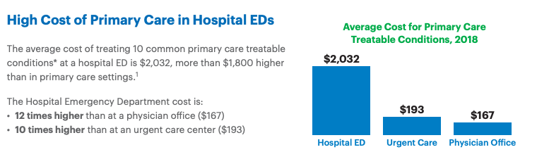

```js
// imports

import { DistP,MatrixSolver } from "./components/DistP.js"

import * as d3 from "https://cdn.jsdelivr.net/npm/d3@7/+esm";
import { require } from "d3-require";
const jStat = await require("jstat@1.9.4");
const math = await require("mathjs@9.4.2");
import {
  calculateSampleSizeForMeans,
  calculateSampleSizeForProportions,
  calculateVarianceFormulaIndividualRandomized,
  calculateVarianceFormulaClusterRandomized,
  generateVarianceData,
  generateUnifiedVarianceData,
} from "./components/parallelmethods.js"

// import some CSS to keep things well styled
import { defaultStyles } from "./components/styles.js"
const styleElement = html`<style>${defaultStyles}</style>`;
document.head.appendChild(styleElement);
```


# Combating Unnecessary ER Visits: Mass Balance Business Models and Behavior Change

The number of unnecessary **Emergency Room (ER) visits** is alarming. Consider the following:

<div class="quote-box">
    <p class="quote-text">"Most studies find that at least 30% of all ED visits in the US are non-urgent, although select studies such as those using National Hospital Ambulatory Medical Survey data report lower percentages (<10%).<sup><a href="#source-1">[1]</a></sup>
        <sup><a href="#source-2">[2]</a></sup>
        <sup><a href="#source-3">[3]</a></sup>
        <sup><a href="#source-4">[4]</a></sup>
        <sup><a href="#source-5">[5]</a></sup>
        <sup><a href="#source-6">[6]</a></sup>"</p>
    <p class="quote-author">- Uscher-Pines L et al., 2013</p>
</div>

A decade later, not much has changed<sup><a href="#source-7">[7]</a></sup>:

<div class="quote-box">
    <p class="quote-text">"Some patient populations, such as those with chronic pain diagnoses, those with multiple chronic conditions, or older adults, are more likely to utilize EDs frequently.<sup><a href="#source-8">[8]</a></sup> Often people suffering from conditions such as those require highly complex care for health needs stemming from factors such as multimorbidity, psychiatric comorbidities, psychosocial issues, or a combination of these factors.<sup><a href="#source-9">[9]</a></sup> Patients who visit the ED often represent approximately 4.5–8% of ED patients but account for 21–28% of all ED visits.<sup><a href="#source-10">[10]</a></sup> While the definition of 'often' varies with some studies suggesting a threshold of 3 or more annual individual patient visits while others employ 12 or more annual visits,<sup><a href="#source-11">[11]</a></sup> the need to meet the care needs of patients with different interventions in the ED is commonly noted."</p>
    <p class="quote-author">- Memedovich, A. et al., 2024</p>
</div>

Given the significant financial and resource burden that unnecessary ER visits place on the healthcare system, it's time we **do something about it**!

<div class = "horizontal-line"></div>

## Defining the Value Landscape

In healthcare, population health interventions are typically framed using one or more of the following **value levers**:

1. **Reducing unnecessary procedures/claims** by providing timely interventions that lower the risk of complications (e.g., reducing CHF admissions with remote patient monitoring).
2. **Enhancing behavior change** by optimizing interventions through targeted member engagement (e.g., preventing surgeries through personalized outreach).
3. **Improving provider networks** to help decrease admissions and reduce insurance claims payouts.
4. **Increasing intervention efficacy** through ROI-sensitive targeting and multi-channel 'nudging'.
5. **Better biomarker control** linked to medical cost savings (e.g., controlling blood pressure to reduce diabetes complications).
6. **Enhanced utilization management** to decrease paid claims (though this lever is less patient-friendly).
7. **Specific utilization savings** by offering the same services at lower costs.
8. **Incremental benefits from program enrollment**, conditional on engagement or biomarker collection.
9. **Preventing disease progression** and adjusting cost trajectories through early intervention.
10. **Closing and maintaining gaps in care**.
11. **Boosting risk-adjusted revenue** by improving quality metrics like HEDIS or Star ratings.
12. **Realizing ancillary benefits** such as increased productivity and reduced workers' compensation claims (particularly for commercial plans).

While there are other nuanced levers, these constitute the majority of commonly applied strategies.

## Defining the Value Framework for Unnecessary ER Visits

The strategy to reduce unnecessary ER visits primarily hinges on two value levers:

1. **Reducing unnecessary procedures/claims** by engaging members with timely interventions that lower their risk of complications (Value Lever 1).
2. **Achieving specific utilization savings** by providing the same services at a lower cost (Value Lever 7).

While the first lever is relatively straightforward, the second presents challenges. Healthcare service utilization often operates as a zero-sum game—a **mass balance**. When you decrease utilization in one area, it may naturally increase in another. This dynamic complicates the business case and makes accurately accounting for savings more intricate.

<div class = "horizontal-line"></div>

### Assumptions and Hypothesis

To address this, let's define the different **states** surrounding ER utilization:

- **Emergency Room (ER)**: High-cost, emergency care used for all health concerns, including non-emergent issues.
- **Primary Care (PC)**: Regular doctor visits for non-urgent issues, serving as an alternative to ER visits.
- **Urgent Care (UC)**: Quick, less costly treatment centers for minor conditions.
- **Telehealth (TH)**: Virtual care for non-emergent consultations, offering a convenient and low-cost alternative.
- **Self-Care (SC)**: Managing minor conditions at home without direct medical intervention.

**Hypothesis:**

- Members who frequently use the ER incur significant financial burdens due to high out-of-pocket costs.
- By implementing targeted interventions—such as financial education, cost transparency tools, and enhanced access to lower-cost alternatives—we can encourage a portion of these members to reduce their reliance on the ER.

### Mass Balance Modeling

To model the dynamics of healthcare utilization, we can use a **mass balance model**—a concept borrowed from systems engineering. By viewing members as existing within various 'states' or 'boxes'—each representing a healthcare setting—we can model the flow of individuals between these states using **matrix algebra**.

This approach allows us to parameterize the transitions between different healthcare settings, creating a steady-state model that simplifies complex dynamics into manageable mathematical expressions.

#### Creating the Transfer Matrix

We represent the transitions between healthcare settings using a **transfer matrix** (Equation 1). Each element ${tex`f_{\text{from} \to \text{to}}`} represents the fraction of individuals transitioning from one setting to another.

<div class = "figure-container">
<figure>

```js
const equation_1 = tex.block`
\mathbf{T}_{\text{transfer}} = 
\begin{bmatrix}
    f_{\text{ER} \to \text{ER}} & f_{\text{ER} \to \text{PC}} & f_{\text{ER} \to \text{UC}} & f_{\text{ER} \to \text{TH}} & f_{\text{ER} \to \text{SC}} \\
    f_{\text{PC} \to \text{ER}} & f_{\text{PC} \to \text{PC}} & f_{\text{PC} \to \text{UC}} & f_{\text{PC} \to \text{TH}} & f_{\text{PC} \to \text{SC}} \\
    f_{\text{UC} \to \text{ER}} & f_{\text{UC} \to \text{PC}} & f_{\text{UC} \to \text{UC}} & f_{\text{UC} \to \text{TH}} & f_{\text{UC} \to \text{SC}} \\
    f_{\text{TH} \to \text{ER}} & f_{\text{TH} \to \text{PC}} & f_{\text{TH} \to \text{UC}} & f_{\text{TH} \to \text{TH}} & f_{\text{TH} \to \text{SC}} \\
    f_{\text{SC} \to \text{ER}} & f_{\text{SC} \to \text{PC}} & f_{\text{SC} \to \text{UC}} & f_{\text{SC} \to \text{TH}} & f_{\text{SC} \to \text{SC}} \\
\end{bmatrix}`
view(equation_1)
```

<figcaption>

**Equation 1**: Idealized transfer matrix representing the flow of individuals between healthcare settings.

</figcaption>
</figure>
</div>

<div class = "horizontal-line"></div>

### Hypothetical Example


<div class="quote-box"> <p class="quote-text">"Two-thirds of hospital ED visits annually by privately insured individuals in the United States – 18 million out of 27 million – are avoidable.

An avoidable hospital ED visit is a trip to the emergency room that is primary care treatable and not an actual emergency. Ten common primary care treatable conditions frequently treated at hospital EDs include bronchitis, cough, dizziness, flu, headache, low back pain, nausea, sore throat, strep throat, and upper respiratory infection.<sup><a href="#source-12">[12]</a></sup>"</p>



 <p class="quote-author">- UnitedHealth Group, 2024</p> </div>

Let's assume United Healthcare's estimate is accurate, and about 66% of all ER visits are avoidable. Let's also assume that the average cost for telehealth is ~ $90 on average. Now, let's introduce our highly effective intervention program, which manages to reduce 50% of these avoidable visits (roughly 35% of the total ER visits). This leaves about 65% of ER-bound members who will still visit the ER—effectively "immobile." While this is EXTREMELY OPTIMISTIC, let's run with it for now. 

Next, let's consider some off-target effects from our intervention. For instance, some members might confuse urgent care with the emergency department, resulting in a fraction of them heading to their Primary Care doctor instead of staying in urgent care. We’ll also assume a similar, but less significant, off-target effect on telehealth visits.

Here's a quick summary: 

<div class="grid-container"> <div class="body-grid">
<strong>Self-Care (SC):</strong><br>

85% of individuals remain in Self-Care.<br>
5% flow into Primary Care.<br>
5% flow into Urgent Care.<br>
5% flow to Telehealth.<br><br>
<strong>Primary Care (PC):</strong><br>

85% of individuals remain in Primary Care.<br>
15% flow to Emergency Room.<br><br>
<strong>Urgent Care (UC):</strong><br>

80% of individuals remain in Urgent Care.<br>
5% flow into Self-Care.<br>
5% flow to Emergency Room.<br>
10% flow into Telehealth.<br><br>
</div> <div class="body-grid">
<strong>Telehealth (TH):</strong><br>

95% of individuals remain in Telehealth.<br>
5% flow into Emergency Room.<br><br>
<strong>Emergency Room (ER):</strong><br>

75% of individuals remain in the Emergency Room.<br>
5% flow into Telehealth.<br>
10% flow into Primary Care.<br>
10% flow into Urgent Care.<br>
</div> </div>

#### Visualizing the Transfer Matrix

We can visualize the transfer matrix to better understand the flow dynamics:

<div class = "figure-container">
<figure>

```js
const transferMatrix = [
  { from: "Emergency Room", to: "Emergency Room", rate: 0.75 },
//   { from: "Emergency Room", to: "Primary Care", rate: 0.00 },
  { from: "Emergency Room", to: "Urgent Care", rate: 0.10 },
  { from: "Emergency Room", to: "Telehealth", rate: 0.05 },
//   { from: "Emergency Room", to: "Self-Care", rate: 0.00 },

  { from: "Primary Care", to: "Emergency Room", rate: 0.15 },
  { from: "Primary Care", to: "Primary Care", rate: 0.85 },
  { from: "Primary Care", to: "Urgent Care", rate: 0.05 },
//   { from: "Primary Care", to: "Self-Care", rate: 0.00 },

  { from: "Urgent Care", to: "Emergency Room", rate: 0.05 },
  { from: "Urgent Care", to: "Urgent Care", rate: 0.80 },
  { from: "Urgent Care", to: "Telehealth", rate: 0.05 },
  { from: "Urgent Care", to: "Self-Care", rate: 0.05 },

  { from: "Telehealth", to: "Emergency Room", rate: 0.05 },
  { from: "Telehealth", to: "Primary Care", rate: 0.10 },
  { from: "Telehealth", to: "Telehealth", rate: 0.95 },
//   { from: "Telehealth", to: "Self-Care", rate: 0.00 },

  { from: "Self-Care", to: "Primary Care", rate: 0.05 },
  { from: "Self-Care", to: "Self-Care", rate: 0.85 }
];

const fillScale = d3.scaleSequential(d3.interpolateGreens).domain([0, 1]);

function colorContrasD(data, fillScale) {
  return data.map((d) => {
    const color = d3.hcl(fillScale(d.rate));
    return color.l > 60 ? "black" : "white"; // Adjust luminance threshold as needed
  });
}
const transfer_matrix_plot = Plot.plot({
  marks: [
    Plot.cell(transferMatrix, {
      x: "to",
      y: "from",
      fill: "rate", 
      sort: { y: "fill", x: "fill", reverse: false, limit: 20 }  
    }),
    // Add a textual annotation to each cell
    Plot.text(transferMatrix, {
      x: "to",
      y: "from",
      text: "rate", 
      fill: (d) => colorContrasD([d], fillScale)[0]
    }),
    Plot.axisX({anchor: "top"})
  ],
  x: { tickRotate: 90,},
  color: { scheme: "greens"},
  marginLeft: 100,
  marginRight: 100,
  inset:20,
  grid: true,
  subtitle: ""
})

view(transfer_matrix_plot)
```
<figcaption>

**Figure 2**: Visual representation of the transfer matrix.
</figcaption>
</figure>
</div>

#### Defining the Current State

We start by defining the initial number of events in each healthcare setting (Equation 2). Let's assume, for now, that we have an ER problem, but it's not the highest utilized service. 

<div class = "figure-container">
<figure>

```js
const equation_2 = tex.block`
    \text{State}_{\text{current}} = 
    \begin{bmatrix}
        C_{\text{ER}} \\
        C_{\text{PC}} \\
        C_{\text{UC}} \\
        C_{\text{TH}} \\
        C_{\text{SC}}
    \end{bmatrix}
    =
    \begin{bmatrix}
    ${current_state._data[0][0]} \\
    ${current_state._data[1][0]} \\
    ${current_state._data[2][0]} \\
    ${current_state._data[3][0]} \\
    ${current_state._data[4][0]} \\
    \end{bmatrix}`
view(equation_2)
```

<figcaption>

**Equation 2**: Initial state definition, assuming approximately ${math.sum(current_state)} total events across all settings.
</figcaption>
</figure>
</div>

#### Calculating the Future State

By taking the dot product of the current state vector with the transfer matrix, which is effectively a matrix of behavior change flows, we can estimate the future distribution of events (Equation 3):

<div class = "figure-container">
<figure>

```js
// Perform the multiplication
const future_state = math.multiply(transfer_matrix,current_state)

const equation_3 = tex.block`
\text{State}_{\text{current}} \times \mathbf{T}_{\text{transfer}} = \text{State}_{\text{future}}
\\
\therefore
\\
\begin{bmatrix}
    C_{\text{ER}} \\
    C_{\text{PC}} \\
    C_{\text{UC}} \\
    C_{\text{TH}} \\
    C_{\text{SC}}
\end{bmatrix}

\begin{bmatrix}
    f_{\text{ER} \to \text{ER}} & f_{\text{ER} \to \text{PC}} & f_{\text{ER} \to \text{UC}} & f_{\text{ER} \to \text{TH}} & f_{\text{ER} \to \text{SC}} \\
    f_{\text{PC} \to \text{ER}} & f_{\text{PC} \to \text{PC}} & f_{\text{PC} \to \text{UC}} & f_{\text{PC} \to \text{TH}} & f_{\text{PC} \to \text{SC}} \\
    f_{\text{UC} \to \text{ER}} & f_{\text{UC} \to \text{PC}} & f_{\text{UC} \to \text{UC}} & f_{\text{UC} \to \text{TH}} & f_{\text{UC} \to \text{SC}} \\
    f_{\text{TH} \to \text{ER}} & f_{\text{TH} \to \text{PC}} & f_{\text{TH} \to \text{UC}} & f_{\text{TH} \to \text{TH}} & f_{\text{TH} \to \text{SC}} \\
    f_{\text{SC} \to \text{ER}} & f_{\text{SC} \to \text{PC}} & f_{\text{SC} \to \text{UC}} & f_{\text{SC} \to \text{TH}} & f_{\text{SC} \to \text{SC}} \\
\end{bmatrix}
=
\begin{bmatrix}
    F_{\text{ER}} \\
    F_{\text{PC}} \\
    F_{\text{UC}} \\
    F_{\text{TH}} \\
    F_{\text{SC}}
\end{bmatrix}
\\
\therefore
\\
\begin{bmatrix}
    ${current_state._data[0][0]} \\
    ${current_state._data[1][0]} \\
    ${current_state._data[2][0]} \\
    ${current_state._data[3][0]} \\
    ${current_state._data[4][0]} \\
\end{bmatrix}
\times
\begin{bmatrix}
${transfer_matrix._data[0][0]} & ${transfer_matrix._data[0][1]} & ${transfer_matrix._data[0][2]} & ${transfer_matrix._data[0][3]} & ${transfer_matrix._data[0][4]} \\
    ${transfer_matrix._data[1][0]} & ${transfer_matrix._data[1][1]} & ${transfer_matrix._data[1][2]} & ${transfer_matrix._data[1][3]} & ${transfer_matrix._data[1][4]} \\
    ${transfer_matrix._data[2][0]} & ${transfer_matrix._data[2][1]} & ${transfer_matrix._data[2][2]} & ${transfer_matrix._data[2][3]} & ${transfer_matrix._data[2][4]} \\
    ${transfer_matrix._data[3][0]} & ${transfer_matrix._data[3][1]} & ${transfer_matrix._data[3][2]} & ${transfer_matrix._data[3][3]} & ${transfer_matrix._data[3][4]} \\
    ${transfer_matrix._data[4][0]} & ${transfer_matrix._data[4][1]} & ${transfer_matrix._data[4][2]} & ${transfer_matrix._data[4][3]} & ${transfer_matrix._data[4][4]} \\
\end{bmatrix}
=
\begin{bmatrix}
    ${future_state._data[0]} \\
    ${future_state._data[1]} \\
    ${future_state._data[2]} \\
    ${future_state._data[3]} \\
    ${future_state._data[4]}
\end{bmatrix}
`
view(equation_3)
```
<figcaption>

**Equation 3**: Calculating the future state using matrix algebra.
</figcaption>
</figure>
</div>

#### Estimating Cost Savings


To determine the financial impact, we introduce a **cost array ** representing the average cost per event in each care setting. By calculating the difference between the current and future states, and then performing a dot product with the cost array, we can estimate the total savings generated by the intervention.

<div class = "figure-container">
<figure>

```js
const current_state = math.matrix([
  [3000],
  [6000],
  [2200],
  [1800],
  [200]
])

const cost_matrix =  math.matrix([
[2032], 
[105], 
[193], 
[90], 
[5]]) 

// Define the transfer matrix (right-hand side)
const transfer_matrix =math.matrix([
      [0.7500, 0.0000, 0.1000, 0.0000, 0.0000],
      [0.1500, 0.8500, 0.0500, 0.0000, 0.0000],
      [0.0500, 0.0000, 0.8000, 0.0500, 0.0500],
      [0.0500, 0.1000, 0.0000, 0.9500, 0.1000],
      [0.0000, 0.0500, 0.0500, 0.0000, 0.8500]
    ]);

const solver = new MatrixSolver({
  currentState: current_state,
  transferMatrix: transfer_matrix
});

const cost_diff = solver.cost_difference
const output = solver.generateLatexEquation()
view(tex.block`${output["latex-matrices"].calculationStateMatrix_tex}`)

view(tex.block`${output["latex-cost-difference"].costDifferenceMatrix_tex}`)
```

<figcaption>

**Equation 4**: Calculating the cost difference resulting from the intervention.

</figcaption>
</figure>
</div>

<div class = "horizontal-line"></div>

## Solving Generically


You can mess with this however you'd like, but let's initialize this generic solver with some practical information. 


To generalize this approach, we can adjust the model parameters interactively, allowing us to simulate different scenarios and interventions. By updating the transfer matrix, cost array, and initial state, we can observe how changes impact the future state and cost savings.

N.b., that the transition matrix needs to sum to 1 by column. I've implemented a little function that shows you if you've done it correctly. If everything is **<span style="color:green">green</span>**, you're all good. If it's **<span style="color:blue">blue</span>**, then the sum is too high; **<span style="color:red">red</span>** if it's too low.


```js
// Initialize the table and get the reference
let tableInfo = updateTable();

// Append the table to the notebook
view(tableInfo.container);

// Access the current matrices and labels
let currentMatrix = tableInfo.getMatrixData();
let costMatrix = tableInfo.getCostMatrix();
let currentStateMatrix = tableInfo.getCurrentStateMatrix();
let currentLabels = tableInfo.getLabels();


// Access the current outputs
let currentOutputs = tableInfo.getOutputs();

// Create elements to display the outputs
const outputsElement = html`<div></div>`;
const solverOutputElement = html`<div></div>`;
const matrixOutputElement = html`<div></div>`;

view(solverOutputElement);

function updateMatrixOutputElement() {
    matrixOutputElement.innerHTML = ''; // Clear previous content
    // Convert the currentOutputs to a string using JSON.stringify and display it
    matrixOutputElement.appendChild(document.createTextNode(JSON.stringify(currentOutputs, null, 2)));

    
}
// Function to update the outputs display
function updateOutputsDisplay() {
  outputsElement.innerHTML = ''; // Clear previous content
  outputsElement.append(JSON.stringify(currentOutputs, null, 2)); // Display outputs
}

// Function to use the current outputs (your solver)
function useCurrentOutputs() {
  solverOutputElement.innerHTML = ''; // Clear previous content

  const solverGeneric = new MatrixSolver({
    currentState: math.matrix(currentStateMatrix),
    transferMatrix: math.matrix(currentOutputs),
    costMatrix: math.matrix(costMatrix)
  });

  const output_generic = solverGeneric.generateLatexEquation();

  // Display the LaTeX equations
  solverOutputElement.appendChild(tex.block`${output_generic["latex-matrices"].calculationStateMatrix_tex}`);

  solverOutputElement.appendChild(tex.block`${output_generic["latex-cost-difference"].costDifferenceMatrix_tex}`);


}

// Initial display
updateOutputsDisplay();
useCurrentOutputs();

// Update the outputs whenever they change
tableInfo.container.addEventListener('matricesUpdated', (e) => {
  const detail = e.detail;
  currentOutputs = detail.matrixOutput;
  costMatrix = detail.costMatrix;
  currentStateMatrix = detail.currentStateMatrix;


  console.log("Received updated matrices:", currentOutputs, costMatrix, currentStateMatrix);

  // Update the outputs display
  updateOutputsDisplay();

  // Update the solver output
  useCurrentOutputs();
});

```


```js
// Import required libraries from the Observable standard library

// Define the updateTable function
function updateTable() {
  let defaultLabels = ["Emergency Room", "Primary Care", "Urgent Care", "Telehealth", "Self-Care"];
  let matrixSize = 5; // Default matrix size

  // State object to hold matrices and outputs
  const state = {
    matrixData: [
      [0.7500, 0.0000, 0.1000, 0.0000, 0.0000],
      [0.1500, 0.8500, 0.0500, 0.0000, 0.0000],
      [0.0500, 0.0000, 0.8000, 0.0500, 0.0500],
      [0.0500, 0.1000, 0.0000, 0.9500, 0.1000],
      [0.0000, 0.0500, 0.0500, 0.0000, 0.8500]
    ],
    costMatrix: [
      [2032], 
        [105], 
        [193], 
        [90], 
        [5]
    ],
    currentStateMatrix: [
      [3000],
      [6000],
      [2200],
      [1800],
      [200]
    ],
    matrixOutput: null
  };

  // Create a container element
  const container = html`<div></div>`;

  // Create a slider for matrix size
  const sizeSlider = Inputs.range([2, 5], {
    step: 1,
    value: matrixSize,
    label: "Matrix Size"
  });
  container.append(sizeSlider);

  // Handle slider changes
  sizeSlider.oninput = (e) => {
    matrixSize = +e.target.value;
    adjustMatrixData(); // Adjust the matrix size
    updateMatrixInputs(); // Re-render inputs
  };

  // Create an input field for matrix labels
  const labelsInput = Inputs.text({
    value: defaultLabels.slice(0, matrixSize).join(", "),
    label: "Enter labels (comma-separated)",
    placeholder: "Enter your labels",
    width: 500
  });
  container.append(labelsInput);

  // Handle label changes
  labelsInput.oninput = () => {
    updateMatrixInputs(); // Re-render inputs when labels change
  };

  // Function to split and update labels
  function getMatrixLabels() {
    return labelsInput.value.split(",").map((d) => d.trim()).slice(0, matrixSize);
  }

  // Function to adjust the matrix size
  function adjustMatrixData() {
    let newMatrix = Array(matrixSize)
      .fill()
      .map((_, i) =>
        Array(matrixSize)
          .fill(0)
          .map((_, j) => (state.matrixData[i] && state.matrixData[i][j] !== undefined ? state.matrixData[i][j] : 0))
      );
    state.matrixData = newMatrix; // Update matrixData in the state object

    let newCostMatrix = Array(matrixSize)
      .fill()
      .map((_, i) => [state.costMatrix[i] !== undefined ? state.costMatrix[i][0] : 0]);
    state.costMatrix = newCostMatrix;

    let newCurrentStateMatrix = Array(matrixSize)
      .fill()
      .map((_, i) => [state.currentStateMatrix[i] !== undefined ? state.currentStateMatrix[i][0] : 0]);
    state.currentStateMatrix = newCurrentStateMatrix;

    updateMatrixOutputs(); // Update the outputs
  }

  // Variable to store references to footer cells
  let footerCells = [];

  // Function to update the matrix input table
  function updateMatrixInputs() {
    const labels = getMatrixLabels();

    // Clear the existing matrix table
    const existingTable = container.querySelector("#matrix-table");
    if (existingTable) existingTable.remove();

    // Calculate column sums
    const columnSums = Array(matrixSize).fill(0);
    for (let j = 0; j < matrixSize; j++) {
      for (let i = 0; i < matrixSize; i++) {
        columnSums[j] += parseFloat(state.matrixData[i][j]) || 0;
      }
    }

    // Reset footerCells
    footerCells = [];

    // Create a new matrix table
    const table = html`<table id="matrix-table" style="border-collapse: collapse;"">
    <br>
    <h4>Transition Matrix: Behavior Change Flows (%)</h4>
      <thead>
        <tr>
          <th></th>
          ${labels.map((label) => html`<th style="padding: 5px;">${label}</th>`)}
        </tr>
      </thead>
      <tbody>
        ${labels.map(
          (from, i) => html`<tr>
            <th style="padding: 5px;">${from}</th>
            ${labels.map((to, j) => {
              // Create the input element
              const input = html`<input
                type="number"
                min="0"
                max="1"
                step="0.01"
                value="${state.matrixData[i][j]}"
                style="width: 50px;"
              >`;
              // Assign the event handler directly
              input.oninput = (e) => updateMatrix(i, j, +e.target.value);
              return html`<td>${input}</td>`;
            })}
          </tr>`
        )}
      </tbody>
      <tfoot>
        <tr>
          <th style="padding: 5px;">Sum</th>
          ${columnSums.map((sum, index) => {
            let sumText = sum.toFixed(2);
            let style = "padding: 5px; font-weight: bold;";
            if (Math.abs(sum - 1) < 0.0001) {
              // Sum equals 1
              style += " color: green;";
            } else if (sum < 1) {
              // Sum less than 1
              style += " color: red;";
            } else if (sum > 1) {
              // Sum greater than 1
              style += " color: blue;";
            }
            // Create the footer cell and store it
            const cell = html`<td style="${style}">${sumText}</td>`;
            footerCells.push(cell);
            return cell;
          })}
        </tr>
      </tfoot>
    </table>`;

    // Append the new table to the container
    container.append(table);

    // Update the cost matrix inputs
    updateCostMatrixInputs();

    // Update the current state matrix inputs
    updateCurrentStateMatrixInputs();
  }

  // Function to update the column sums without rebuilding the entire table
  function updateColumnSums() {
    const labels = getMatrixLabels();
    const matrixSize = labels.length;
    const columnSums = Array(matrixSize).fill(0);
    for (let j = 0; j < matrixSize; j++) {
      for (let i = 0; i < matrixSize; i++) {
        columnSums[j] += parseFloat(state.matrixData[i][j]) || 0;
      }
    }
    // Update footer cells
    for (let j = 0; j < matrixSize; j++) {
      let sum = columnSums[j];
      let sumText = sum.toFixed(2);
      let style = "padding: 5px; font-weight: bold;";
      if (Math.abs(sum - 1) < 0.0001) {
        style += " color: green;";
      } else if (sum < 1) {
        style += " color: red;";
      } else if (sum > 1) {
        style += " color: blue;";
      }
      footerCells[j].style = style;
      footerCells[j].textContent = sumText;
    }
  }

  // Function to update the matrix cell
  function updateMatrix(i, j, value) {
    state.matrixData[i][j] = value; // Update the matrix cell in the state object
    updateMatrixOutputs(); // Ensure the outputs are updated
    updateColumnSums(); // Update the sums in the footer
  }

  // Function to update the cost matrix input
  function updateCostMatrix(i, value) {
    state.costMatrix[i][0] = value;
    updateMatrixOutputs();
  }

  // **Function to update the current state matrix input**
  function updateCurrentStateMatrix(i, value) {
    state.currentStateMatrix[i][0] = value;
    updateMatrixOutputs();
  }

  // Function to create cost matrix inputs
  function updateCostMatrixInputs() {
    const labels = getMatrixLabels();

    // Remove existing cost matrix inputs if any
    const existingCostMatrix = container.querySelector("#cost-matrix");
    if (existingCostMatrix) existingCostMatrix.remove();

    // Create a container for the cost matrix inputs
    const costMatrixContainer = html`<div id="cost-matrix">
    <br>
      <h4>Cost Matrix: Average $ per event</h4>
      <table style="border-collapse: collapse;">
        <thead>
          <tr>
            <th style="padding: 5px;">Label</th>
            <th style="padding: 5px;">Cost</th>
          </tr>
        </thead>
        <tbody>
          ${labels.map((label, i) => {
            const input = html`<input type="number" min="0" step="1" value="${state.costMatrix[i][0]}" style="width: 80px;">`;
            input.oninput = (e) => updateCostMatrix(i, +e.target.value);
            return html`<tr>
              <td style="padding: 5px;">${label}</td>
              <td>${input}</td>
            </tr>`;
          })}
        </tbody>
      </table>
    </div>`;

    // Append the cost matrix container to the main container
    container.append(costMatrixContainer);
  }

  // Function to create current state matrix inputs
  function updateCurrentStateMatrixInputs() {
    const labels = getMatrixLabels();

    // Remove existing current state matrix inputs if any
    const existingCurrentStateMatrix = container.querySelector("#current-state-matrix");
    if (existingCurrentStateMatrix) existingCurrentStateMatrix.remove();

    // Create a container for the current state matrix inputs
    const currentStateMatrixContainer = html`<div id="current-state-matrix">
    <br>
      <h4>Current State Matrix: # of Events</h4>
      <table style="border-collapse: collapse;">
        <thead>
          <tr>
            <th style="padding: 5px;">Label</th>
            <th style="padding: 5px;">Current State</th>
          </tr>
        </thead>
        <tbody>
          ${labels.map((label, i) => {
            const input = html`<input type="number" min="0" step="1" value="${state.currentStateMatrix[i][0]}" style="width: 80px;">`;
            input.oninput = (e) => updateCurrentStateMatrix(i, +e.target.value); // Correctly defined function
            return html`<tr>
              <td style="padding: 5px;">${label}</td>
              <td>${input}</td>
            </tr>`;
          })}
        </tbody>
      </table>
    </div>`;

    // Append the current state matrix container to the main container
    container.append(currentStateMatrixContainer);
  }

  // Function to return the updated matrix outputs
  function updateMatrixOutputs() {
    const matrixOutputs = state.matrixData.map((row) => [...row]); // Clone the matrixData
    state.matrixOutput = matrixOutputs;
    console.log("Updated matrices:", {
      matrixOutput: state.matrixOutput,
      costMatrix: state.costMatrix,
      currentStateMatrix: state.currentStateMatrix
    });
    // Dispatch a custom event with the updated outputs and other matrices
    container.dispatchEvent(new CustomEvent('matricesUpdated', { detail: {
      matrixOutput: state.matrixOutput,
      costMatrix: state.costMatrix,
      currentStateMatrix: state.currentStateMatrix
    }}));
  }

  // Initialize the matrix inputs and outputs
  updateMatrixInputs();
  updateMatrixOutputs();

  // Return the container and methods to access the data
  return {
    container: container,
    getMatrixData: () => state.matrixData,
    getCostMatrix: () => state.costMatrix,
    getCurrentStateMatrix: () => state.currentStateMatrix,
    getLabels: () => getMatrixLabels(),
    getOutputs: () => state.matrixOutput
  };
}
```

Oh good! If you haven't played with the example, and despite some of our off targeted effects driving spend a bit less efficiently than hoped, we'll save some money (~$1M or so). Nice. We'll see ~ 630 less ER visits than we would have otherwise normally observed. I hope we save some lives and some out of pocket costs for our members, as well! 


<div class = "figure-container">

### Power Analysis

**How can we be confident that our interventions are effectively reducing unnecessary ER utilization?**

To validate our efforts, we need to design an experiment capable of detecting a statistically significant reduction in ER visits due to our intervention.

#### Defining the Objective

Our primary goal is to observe a **relative reduction** in ER utilization. Specifically, we aim to determine the number of participants required to detect a certain percentage decrease in ER visits with a given level of confidence and statistical power.

#### Statistical Framework

We will use a **two-proportion Z-test** to compare the ER utilization rates between the control group (without intervention) and the intervention group (with our proposed measures).

The sample size required for each group can be calculated using the following formula:

```js
const equation_4 = tex.block` \begin{equation} n = \frac{(Z_{1-\alpha/2} + Z_{1-\beta})^2 [p_1 (1 - p_1) + p_2 (1 - p_2)]}{(p_1 - p_2)^2} \end{equation}`
view(equation_4)
```

Where:

- ${tex`n`} is the sample size per group.
- ${tex`Z_{1-\alpha/2}`} is the Z-score corresponding to the desired significance level (α).
- ${tex`Z_{1-\beta}`} is the Z-score corresponding to the desired power (1 - β).
- ${tex`p_1`} is the ER utilization rate in the control group.
- ${tex`p_2`} is the ER utilization rate in the intervention group.

Since we're aiming for a relative reduction, we can express ${tex`p_2`} in terms of ${tex`p_1`} and the relative decrease ${tex`R_{\text{relative decrease}}`}. 


```js
const equation_p2 = tex.block`p_2 = p_1 \times (1 - R_{\text{relative~decrease}})`
view(equation_p2)
```

To initialize this problem (and you can play with whatever you'd like), let's assume that we're looking to observe a relative ~50% decrease in avoidable visits. Let's assume the UnitedHealth is correct, and roughly the rate of ER utilization is ~27M of 164M privately insured lives in the USA, or roughtly ~16.4% in the general commercial population. This would means we want to observe our base rate shift during our experiment from ~16.4% to 11% (Avoidable Visits: 66% of total ED visits.
Reduction of Avoidable Visits: 50% of avoidable visits = 50% of 66% = 33% of total ED visits.)

That would make our ${tex`{P_1}`} = 0.164 and our ${tex`R_{\text{relative decrease}}`} = 0.33.

Let's consider the following parameters:

```js
const Example1Form = Inputs.form({
  z_alpha_2_proportions: Inputs.range([0, 5], {
    value: 1.96,
    step: 0.01,
    label: tex`Z_{1-\alpha/2}`,
  }),
  z_beta_proportions: Inputs.range([0, 5], {
    value: 0.84,
    step: 0.01,
    label: tex`Z_{1-\beta}`,
  }),
  p1_proportions: Inputs.range([0, 1], {
    value: 0.164,
    step: 0.01,
    label: tex`p_1`,
  }),

  relative_decrease: Inputs.range([0, 1], {
    value: 0.33,
    step: 0.01,
    label: tex`R_{\text{relative~decrease}}`,
  }),
})
view(Example1Form)
const Example1Form_Selections = Generators.input(Example1Form)
```

Calculating \( p_2 \):

```js
const relative_p2_calc =
  Example1Form_Selections.p1_proportions *
  (1 - Example1Form_Selections.relative_decrease)
const p2_proportions_r = Inputs.range([0, 1], {
  value: relative_p2_calc,
  step: 0.01,
  label: tex`p_2`,
  disabled: true,
})
view(p2_proportions_r)
```

Calculating the required sample size:

```js
const n_proportions_wand = calculateSampleSizeForProportions(
  Example1Form_Selections.z_alpha_2_proportions,
  Example1Form_Selections.z_beta_proportions,
  Example1Form_Selections.p1_proportions,
  relative_p2_calc
)
```

With these parameters, we determine that approximately <strong>${n_proportions_wand} </strong> are needed in each group to detect a <strong> ${Example1Form_Selections.relative_decrease*100} </strong> % relative reduction in ER utilization with 80% power at a 5% significance level (assuming you didn't change the Z's above :-).

That's not very much, but then again, this would be a _true_ RCT and not an intent to treat RCT. Further, the behavior change rate and relative reduction observed is somewhat _absurd_. If we were to redo this for something more reasonable (like a ~10% relative reduction in Uneccessary ER), we would need a lot more people (<strong>~7890</strong> per arm).

</div>


## Citations

<div class="bibliography">
    <p id="source-1"><strong>[1]</strong> Northington W, Brice J, Zou B. Use of an emergency department by nonurgent patients. <em>American Journal of Emergency Medicine</em>. 2005;23:131–137. doi: <a href="https://doi.org/10.1016/j.ajem.2004.05.006" target="_blank">10.1016/j.ajem.2004.05.006</a>.</p>
    <p id="source-2"><strong>[2]</strong> Carret M, Fassa A, Domingues M. Inappropriate use of emergency services: a systematic review of prevalence and associated factors. <em>Cad. Saúde Pública</em>. 2009;25(1):7–28. doi: <a href="https://doi.org/10.1590/s0102-311x2009000100002" target="_blank">10.1590/s0102-311x2009000100002</a>.</p>
    <p id="source-3"><strong>[3]</strong> Durand A, Gentile S, Devictor B, et al. ED patients: how nonurgent are they? Systematic review of the emergency medicine literature. <em>American Journal of Emergency Medicine</em>. 2010. doi: <a href="https://doi.org/10.1016/j.ajem.2010.01.003" target="_blank">10.1016/j.ajem.2010.01.003</a>.</p>
    <p id="source-4"><strong>[4]</strong> Guttman N, Zimmerman D, Nelson M. The Many Faces of Access: Reasons for Medically Nonurgent Emergency Department Visits. <em>Journal of Health Politics, Policy and Law</em>. 2003;28(6). doi: <a href="https://doi.org/10.1215/03616878-28-6-1089" target="_blank">10.1215/03616878-28-6-1089</a>.</p>
    <p id="source-5"><strong>[5]</strong> Kellerman A. Nonurgent emergency department visits. <em>JAMA</em>. 1994;271:1953–1955.</p>
    <p id="source-6"><strong>[6]</strong> National Center for Health Statistics. National Hospital Ambulatory Medical Care Survey: 2008 Emergency Department Summary Tables. 2008.</p>
    <p id="source-7"><strong>[7]</strong> Memedovich, A., Asante, B., Khan, M. et al. A mapping review of interventions to address patients who frequently seek care in the emergency department. <em>BMC Emerg Med</em> 24, 49 (2024). doi: <a href="https://doi.org/10.1186/s12873-024-00970-7" target="_blank">10.1186/s12873-024-00970-7</a>.</p>
    <p id="source-8"><strong>[8]</strong> Kimmel HJ, Brice YN, Trikalinos TA, Sarkar IN, Ranney ML. Real-time Emergency Department Electronic notifications regarding high-risk patients: a systematic review. <em>Telemed J E Health</em>. 2019;25(7):604–18.</p>
    <p id="source-9"><strong>[9]</strong> Hudon C, Courteau J, Krieg C, Vanasse A. Factors associated with chronic frequent emergency department utilization in a population with diabetes living in metropolitan areas: a population-based retrospective cohort study. <em>BMC Health Serv Res</em>. 2017;17(1):525.</p>
    <p id="source-10"><strong>[10]</strong> Kumar GS, Klein R. Effectiveness of case management strategies in reducing emergency department visits in frequent user patient populations: a systematic review. <em>J Emerg Med</em>. 2013;44(3):717–29.</p>
    <p id="source-11"><strong>[11]</strong> Chiu YM, Vanasse A, Courteau J, et al. Persistent frequent emergency department users with chronic conditions: a population-based cohort study. <em>PLoS ONE</em>. 2020;15(2):e0229022.</p>
    <p id="source-12"><strong>[12]</strong> UnitedHealth Group. High Cost of Emergency Department Visits Could Be Avoided with Better Primary Care Access. <em>UnitedHealth Group</em>, 2019. <a href="https://www.unitedhealthgroup.com/newsroom/posts/2019-07-22-high-cost-emergency-department-visits.html">Link</a>.</p> <p id="source-9"><strong>[9]</strong> UnitedHealth Group. High Cost of Emergency Department Visits Could Be Avoided with Better Primary Care Access. <em>UnitedHealth Group</em>, 2019. <a href="https://www.unitedhealthgroup.com/newsroom/posts/2019-07-22-high-cost-emergency-department-visits.html">Link</a>.</p> 
</div>


<!--  
# Combating Uneccessary ER --  Mass Balance Business models with Behavior Change

Why ER visits and not MSK spend? The MSK market spend in the U.S. is more than $874B in medical costs and lost wages. MSK is the #1 medical cost driver for employers – employers spend more healthcare dollars on MSK diseases than cancer, cardiovascular, diabetes or maternity. Musculoskeletal disorders account for more than 50% of disabling health conditions reported by adults. MSK is affected by age, occupation, activity level, lifestyle, and family history and is expected to increase with the aging of the US population and increase in obesity rates.

However, this article [Deciding to Visit the Emergency Department for Non-Urgent Conditions: A Systematic Review of the Literature](https://pmc.ncbi.nlm.nih.gov/articles/PMC4156292/#R8) and this quote absolutely terrified me:

<div class="quote-box">
    <p class="quote-text">"Most studies find that at least 30% of all ED visits in the US are non-urgent, although select studies such as those using National Hospital Ambulatory Medical Survey data report lower percentages (<10%).<sup><a href="#source-1">[1]</a></sup>
        <sup><a href="#source-2">[2]</a></sup>
        <sup><a href="#source-3">[3]</a></sup>
        <sup><a href="#source-4">[4]</a></sup>
        <sup><a href="#source-5">[5]</a></sup>
        <sup><a href="#source-6">[6]</a></sup>"</p>
    <p class="quote-author">- Uscher-Pines L et al., 2013</p>
</div>


It looks like not much has changed from 2013 to 2024<sup><a href="#source-7">[7]</a></sup></p>. 

<div class="quote-box">
    <p class="quote-text">"Some patient populations, such as those with chronic pain diagnoses, those with multiple chronic conditions, or older adults, are more likely to utilize EDs frequently <sup><a href="#source-8">[8]</a></sup>. Often people suffering from conditions such as those require highly complex care for health needs stemming from factors such as multimorbidity, psychiatric comorbidities, psychosocial issues, or a combination of these factors <sup><a href="#source-9">[9]</a></sup>. Patients who visit the ED often represent approximately 4.5–8% of ED patients but account for 21–28% of all ED visits <sup><a href="#source-10">[10]</a></sup>. While the definition of “often” varies with some studies suggesting a threshold of 3 or more annual individual patient visits while others employ 12 or more annual visits <sup><a href="#source-11">[11]</a></sup>, the need to meet the care needs of patients with different interventions in the ED is commonly noted."</p>
    <p class="quote-author">- Memedovich, A. et al., 2024
</div>

Let's try to do something about it!! 

## Defining the value landscape

Generically, population health interventions in the healthcare world are framed using one or more of the following value levers: 

1. Decreasing the # of unnecessary procedures/claims by intersecting members with timely interventions that reduce member's risk of complications (e.g., CHF admission risk with remote patient monitoring).
2. Boost behavior change of an existing intervention (e.g., optimize behavior change through member claim journey targeting for surgery prevention targeting).
3. Provider networks enhancement. Can this technology help providers decrease admissions and/or things that insurance pays out in claims?
4. Increasing the efficacy of intervention through ROI-sensitive targeting w/ multi- channel ‘nudging’. Does this give them an extra opportunity to risk-triage their member base in a smart way?
5. Better control of a critical biomarker linked to med cost savings. Does better control of blood pressure decrease a member with diabetes' likelihood to admit? Yes, yes it does (https://cardiab.biomedcentral.com/articles/10.1186/s12933-016-0485-3)
6. Enhanced utilization management — does this enable insurance companies to decrease paid claims (this is a terrible value lever to pull, but important for insurance companies).
7. A specific utilization savings (e.g., Rx or vendor switch). Can we provide the same service they're already getting, for less?
8. Incremental benefit of enrolling in a program, conditional on engagement/collection of a biomarker (e.g., A1C). Do we collect critical biomarkers that help them enroll their members in other programs they would, under other circumstances, be unable to legitimize?
9. Preventing progression and cost trajectory adjustment. E.g., Does early screening/diagnosis result in a lower cost trajectory? Can early intervention and BP control decrease long term costs in excess of the cost to provide care?
10. Closing gaps in care and keeping gaps in care closed
11. Increase Risk adjusted revenue by thoughtfully move Star ratings by addressing HEDIS or other quality opportunities. 
12. Ancillary benefits of the intervention (e.g., productivity and workers compensation) [only for commercial plans].


I will note that there are other, more nuanced, levers, but these consistute the majority of commonly applied levers. 

## Defining the value framework for Unnecessary ER 
The case of decreasing unecessary ER is almost entirely two factors: 
1.  (1 above) -- Decreasing the # of unnecessary procedures/claims by intersecting members with timely interventions that reduce member's risk of complications; and
2. (7 above) -- A specific utilization savings (e.g., Rx or vendor switch). Can we provide the same service they're already getting, for less?

(1) is fairly straightforward. (2), is not. Service utilization is a zero sum game -- a mass balance. If you decrease service utilization in one area, it naturally increases in another. That 'dulls' the business case someowhat and makes it tricky to correctly account for savings.  

### Assumptions and Hypothesis 

Let's start by assuming the states of being surrounding Emergency Room utilization. For our purposes, let's go with a simplified explanation of each state
- **Emergency Room**: High-cost, emergency care, used for all kinds of health concerns, even those that don’t need it.
- **Primary Care**: Regular doctor visits for non-urgent issues, avoiding the ER.
- **Urgent Care**: Use of urgent care centers for quicker, less costly treatment of minor conditions.
- **Self-Care**: Managing minor conditions at home with minimal medical intervention.
- **Telehealth**: Virtual care for non-emergent consultations, providing a low-cost, convenient alternative to in-person visits.

Let's frame our hypothesis, as follows: 
- Members who frequently use the Emergency Room experience <strong>significant financial burdens due to high out-of-pocket costs</strong>. 
- Implementing targeted interventions, such as financial education, cost transparency tools, and targeted educationed aimed to increase understanding and access to lower-cost alternatives (such as Primary Care, Urgent Care, Telehealth, or Self-Care), it is possible to nudge a portion of these members away from ER reliance. 

### Mass balance
So... how do we represent this? Well, the good news is that the value framework for evaluatating uneccessary ER spend can be addressed in a single, unified business model. I also happen to think that this approach is a clever use of matrix algebra. 

Let's conceptually think of members as existing within several defined boxes where each box represents an intervention or procedure, we can parameterize the flow of membership between boxes (or procedures, or end states, or _whatever_) as a differential-equation based, mass-balance model. This is efficient, and can be executed and conceptualized at steady state where the math becomes trivial.

So, how do we represent the flow transition state mathematically? 

Easy. We create a transfer matrix. 
 
The transfer matrix (Equation 1) represents the fraction of individuals flowing between various healthcare settings. Each column corresponds to a healthcare setting from which individuals flow, and each row represents the setting to which individuals flow. The sum of each column equals 1, indicating that all individuals either stay in their current setting or transfer to another.

<div class = "figure-container">
<figure>

```js
const equation_1 = tex.block`
\mathbf{T}_{\text{transfer}} = 
\begin{bmatrix}
    f_{\text{ER} \to \text{ER}} & f_{\text{ER} \to \text{PC}} & f_{\text{ER} \to \text{UC}} & f_{\text{ER} \to \text{TH}} & f_{\text{ER} \to \text{SC}} \\
    f_{\text{PC} \to \text{ER}} & f_{\text{PC} \to \text{PC}} & f_{\text{PC} \to \text{UC}} & f_{\text{PC} \to \text{TH}} & f_{\text{PC} \to \text{SC}} \\
    f_{\text{UC} \to \text{ER}} & f_{\text{UC} \to \text{PC}} & f_{\text{UC} \to \text{UC}} & f_{\text{UC} \to \text{TH}} & f_{\text{UC} \to \text{SC}} \\
    f_{\text{TH} \to \text{ER}} & f_{\text{TH} \to \text{PC}} & f_{\text{TH} \to \text{UC}} & f_{\text{TH} \to \text{TH}} & f_{\text{TH} \to \text{SC}} \\
    f_{\text{SC} \to \text{ER}} & f_{\text{SC} \to \text{PC}} & f_{\text{SC} \to \text{UC}} & f_{\text{SC} \to \text{TH}} & f_{\text{SC} \to \text{SC}} \\
\end{bmatrix}`
view(equation_1)

```
<figcaption>

Equation 1: Idealized transfer matrix. 

Where: 
- ${tex`\text{ER}`} is the Emergency Room, where patients receive acute and emergency medical care.
- ${tex`\text{PC}`} is Primary Care, where patients receive general medical services and preventive care.
- ${tex`\text{UC}`} is Urgent Care, where patients receive immediate treatment for non-emergency conditions.
- ${tex`\text{TH}`} is Telehealth, where patients receive medical consultations and care remotely.
- ${tex`\text{SC}`} is Self-Care, where patients manage their own health without direct medical supervision or utilization.
</figcaption>
</figure>
</div>

As an example, let's assume that our intervention will be EXTREMELY successful (this is _extremely_) unrealistic, but let's show the hypothetical example first and then create a live example second. N.b., that for the diagonal values (such as ER to ER or PC to PC), these represent the proportion of individuals that remain stationary in their current setting.

<div class="grid-container">
<div class="body-grid">
<strong>Self-Care (SC):</strong><br>
- 90% of individuals remain in Self-Care.<br>
- 10% flow into Primary Care.<br><br>

<strong>Primary Care (PC):</strong><br>
- 85% of individuals remain in Primary Care.<br>
- 5% flow to Self-Care<br>
- 5% flow to Urgent Care<br>
- 5% flow to Emergency Room.<br><br>

<strong>Urgent Care (UC):</strong><br>
- 80% of individuals stay in Urgent Care.<br>
- 10% flow into Telehealth.<br>
- 5% flow into Self-Care<br>
- 5% flow to Emergency Room.
</div>
<div class="body-grid">
<strong>Telehealth (TH):</strong><br>
- 75% of individuals remain in Telehealth.<br>
- 10% flow into Primary Care<br>
- 10% flow to Self-Care.<br>
- 5% flow into Emergency Room.<br><br>

<strong>Emergency Room (ER):</strong><br>
- 65% of individuals remain in the Emergency Room.<br>
- 10% flow into Primary Care<br>
- 10% flow to Urgent Care<br>
- 10% flow to Telehealth.<br>
- 5% flow into Self-Care.
</div>
</div>


Let's visualize our transfer matrix, below. 

<div class = "figure-container">
<figure>

```js
const transferMatrix = [
  { from: "Emergency Room", to: "Emergency Room", rate: 0.65 },
  { from: "Emergency Room", to: "Primary Care", rate: 0.10 },
  { from: "Emergency Room", to: "Urgent Care", rate: 0.10 },
  { from: "Emergency Room", to: "Telehealth", rate: 0.10 },
  { from: "Emergency Room", to: "Self-Care", rate: 0.05 },

  { from: "Primary Care", to: "Emergency Room", rate: 0.05 },
  { from: "Primary Care", to: "Primary Care", rate: 0.85 },
  { from: "Primary Care", to: "Urgent Care", rate: 0.05 },
  { from: "Primary Care", to: "Self-Care", rate: 0.05 },

  { from: "Urgent Care", to: "Emergency Room", rate: 0.05 },
  { from: "Urgent Care", to: "Urgent Care", rate: 0.80 },
  { from: "Urgent Care", to: "Telehealth", rate: 0.10 },
  { from: "Urgent Care", to: "Self-Care", rate: 0.05 },

  { from: "Telehealth", to: "Emergency Room", rate: 0.05 },
  { from: "Telehealth", to: "Primary Care", rate: 0.10 },
  { from: "Telehealth", to: "Telehealth", rate: 0.75 },
  { from: "Telehealth", to: "Self-Care", rate: 0.10 },

  { from: "Self-Care", to: "Primary Care", rate: 0.10 },
  { from: "Self-Care", to: "Self-Care", rate: 0.90 }
];

const fillScale = d3.scaleSequential(d3.interpolateGreens).domain([0, 1]);

function colorContrasD(data, fillScale) {
  return data.map((d) => {
    const color = d3.hcl(fillScale(d.rate));
    return color.l > 60 ? "black" : "white"; // Adjust luminance threshold as needed
  });
}
const transfer_matrix_plot = Plot.plot({
  marks: [
    Plot.cell(transferMatrix, {
      x: "to",
      y: "from",
      fill: "rate", 
      sort: { y: "fill", x: "fill", reverse: false, limit: 20 }  
    }),
    // Add a textual annotation to each cell
    Plot.text(transferMatrix, {
      x: "to",
      y: "from",
      text: "rate", 
      fill: (d) => colorContrasD([d], fillScale)[0]
    }),
    Plot.axisX({anchor: "top"})
  ],
  x: { tickRotate: 90,},
  color: { scheme: "greens"},
  marginLeft: 100,
  marginRight: 100,
  inset:20,
  grid: true,
  subtitle: ""
})

view(transfer_matrix_plot)
```
<figcaption>
Figure 2: Transfer Matrix. 
</figcaption>
</figure>
</div>

Now let's define the current state (Equation 2) and then use our transfer matrix to assess what the impact of our intervention to decrease unnecessary ER spend will be. 


<div class = "figure-container">
<figure>

```js
const equation_2 = tex.block`
    \text{State}_{\text{current}} = 
    \begin{bmatrix}
        C_{\text{ER}} \\
        C_{\text{PC}} \\
        C_{\text{UC}} \\
        C_{\text{TH}} \\
        C_{\text{SC}}
    \end{bmatrix}
    =
    \begin{bmatrix}
        3000 \\
        6000 \\
        2200 \\
        1800 \\
        200
    \end{bmatrix}`

view(equation_2)
```

<figcaption>
Equation 2: Initial state definition. Let's assume that there are ~13,200 ER, PC, UC, TH, and SC events that handle roughly the same event. 
</figcaption>
</figure>
</div>

Let's bring it all together and do some math. 

<div class = "figure-container">
<figure>

```js
// Let's do this once by hand and then build a function to do it. 
// Define the state matrix (left-hand side vector)
const current_state = math.matrix([
  [3000],
  [6000],
  [2200],
  [1800],
  [200]
])

const cost_matrix =  math.matrix([
[500], 
[200], 
[150], 
[100], 
[50]]) 

// Define the transfer matrix (right-hand side)
const transfer_matrix =math.matrix([
  [0.65, 0.10, 0.10, 0.10, 0.05],
  [0.05, 0.85, 0.05, 0.00, 0.05],
  [0.05, 0.00, 0.80, 0.10, 0.05],
  [0.05, 0.10, 0.00, 0.75, 0.10],
  [0.00, 0.10, 0.00, 0.00, 0.90]
]);

// Perform the multiplication
const future_state = math.multiply(transfer_matrix,current_state)

const equation_3 = tex.block`
\text{State}_{\text{current}} \times \mathbf{T}_{\text{transfer}} = \text{State}_{\text{future}}
\\
\therefore
\\
\begin{bmatrix}
    C_{\text{ER}} \\
    C_{\text{PC}} \\
    C_{\text{UC}} \\
    C_{\text{TH}} \\
    C_{\text{SC}}
\end{bmatrix}

\begin{bmatrix}
    f_{\text{ER} \to \text{ER}} & f_{\text{ER} \to \text{PC}} & f_{\text{ER} \to \text{UC}} & f_{\text{ER} \to \text{TH}} & f_{\text{ER} \to \text{SC}} \\
    f_{\text{PC} \to \text{ER}} & f_{\text{PC} \to \text{PC}} & f_{\text{PC} \to \text{UC}} & f_{\text{PC} \to \text{TH}} & f_{\text{PC} \to \text{SC}} \\
    f_{\text{UC} \to \text{ER}} & f_{\text{UC} \to \text{PC}} & f_{\text{UC} \to \text{UC}} & f_{\text{UC} \to \text{TH}} & f_{\text{UC} \to \text{SC}} \\
    f_{\text{TH} \to \text{ER}} & f_{\text{TH} \to \text{PC}} & f_{\text{TH} \to \text{UC}} & f_{\text{TH} \to \text{TH}} & f_{\text{TH} \to \text{SC}} \\
    f_{\text{SC} \to \text{ER}} & f_{\text{SC} \to \text{PC}} & f_{\text{SC} \to \text{UC}} & f_{\text{SC} \to \text{TH}} & f_{\text{SC} \to \text{SC}} \\
\end{bmatrix}
=
\begin{bmatrix}
    F_{\text{ER}} \\
    F_{\text{PC}} \\
    F_{\text{UC}} \\
    F_{\text{TH}} \\
    F_{\text{SC}}
\end{bmatrix}
\\
\therefore
\\
\begin{bmatrix}
    3000 \\
    6000 \\
    2200 \\
    1800 \\
    200
\end{bmatrix}
\times
\begin{bmatrix}
    0.65 & 0.10 & 0.10 & 0.10 & 0.05 \\
    0.05 & 0.85 & 0.05 & 0.00 & 0.05 \\
    0.05 & 0.00 & 0.80 & 0.10 & 0.05 \\
    0.05 & 0.10 & 0.00 & 0.75 & 0.10 \\
    0.00 & 0.10 & 0.00 & 0.00 & 0.90 \\
\end{bmatrix}
=
\begin{bmatrix}
    ${future_state._data[0]} \\
    ${future_state._data[1]} \\
    ${future_state._data[2]} \\
    ${future_state._data[3]} \\
    ${future_state._data[4]}
\end{bmatrix}
`
view(equation_3)
```
<figcaption>
Equation 3: Calculating the future state with matrix algebra. 
</figcaption>
</figure>
</div>

That's super neat, but what about the cash? How much money does this save for us? 

Well, to calculate that, we need to introduce a corresponding cost array. In otherwords, we need to have the cost (or the average cost in a simple case) of each categorical expense. Then we need to find the difference between the current and future state and multiply this by the cost state. 

<div class = "figure-container">
<figure>

```js
const solver = new MatrixSolver({
  currentState: current_state,
  transferMatrix: transfer_matrix
});

const cost_diff = solver.cost_difference
const output = solver.generateLatexEquation()
view(tex.block`${output["latex-matrices"].calculationStateMatrix_tex}`)

view(tex.block`${output["latex-cost-difference"].costDifferenceMatrix_tex}`)
```

<figcaption>

Equation 2: Initial state definition. Let's assume that there are ~13,200 ER, PC, UC, TH, and SC events that handle roughly the same event. 
</figcaption>
</figure>
</div>


## Let's solve for this _generically_


### Power Analysis


<div class = "note" label = "Uncessary ER Reduction">

How do you know that we're really reducing unecessary ER utilization? 

Good question. We need to design an experiment to find out! In this example, it's fairly easy. We have the behavior change we'd like to observe in each flow (e.g., the flow from ER to self care, for instance). 

Let's assume we'd like to power the experiment to observe the decrease in ER utilization. N.b., that it may be important to _also_ power the experiment to observe the other flows, as well. After all, how do you know if it's working for the _right_ reasons? In this case, we wwant to observe the _relative_ ER decrease as a function of behavior change (the matrix above is _relative_. )


From our example, we want to reduce our ER our enrollment rate, ${tex`R_{enrollment}`}.

${tex`R_{enrollment}`} is currently set to be:

${tex.block`R_{enrollment} = \frac{n_{enrolled}}{n_{mailed}}`}

Let's say we have a magic wand that incrementally increases the relative enrollment rate by 30%, i.e., ${tex`R_{wand, relative~increase}=0.3`}.

```js
const equation_enrollment = tex.block`R_{enrollment, wand} = \frac{n_{enrolled}}{n_{mailed}}\cdot (1+R_{wand, relative~increase})`

view(equation_enrollment)
```

**Question:** How many people would we need to observe this relative increase in enrollment rate with a given statistical certainty?

**Answer:**

Let's use this equation to calculate:

```js
const equation_4 = tex.block` \begin{equation} n = \frac{(z_{1-\alpha/2} + z_{\beta})^2 [p_1 (1 - p_1) + p_2 (1 - p_2)]}{(p_1 - p_2)^2} \end{equation}`

view(equation_4)
```

```js
const Example1Form = Inputs.form({
  z_alpha_2_proportions: Inputs.range([0, 5], {
    value: 1.96,
    step: 0.01,
    label: tex`Z_{1-\alpha/2}`,
  }),
  z_beta_proportions: Inputs.range([0, 5], {
    value: 0.84,
    step: 0.01,
    label: tex`Z_\beta`,
  }),
  p1_proportions: Inputs.range([0, 1], {
    value: 0.5,
    step: 0.01,
    label: tex`p_1`,
  }),

  relative_increase: Inputs.range([0, 1], {
    value: 0.3,
    step: 0.01,
    label: tex`R_{wand, relative~increase}`,
  }),
})
view(Example1Form)
```

```js
const relative_p2_calc =
  Example1Form_Selections.p1_proportions *
  (1 + Example1Form_Selections.relative_increase)
const p2_proportions_r = Inputs.range([0, 1], {
  value: relative_p2_calc,
  step: 0.01,
  label: tex`p_2`,
  disabled: true,
})
view(p2_proportions_r)
```

```js
const Example1Form_Selections = Generators.input(Example1Form)
```

```js
const n_proportions_wand = calculateSampleSizeForProportions(
  Example1Form_Selections.z_alpha_2_proportions,
  Example1Form_Selections.z_beta_proportions,
  Example1Form_Selections.p1_proportions,
  relative_p2_calc
)
```

</div>


## Citations
Here are some citations.

<div class="bibliography">
    <p id="source-1"><strong>[1]</strong> Northington W, Brice J, Zou B. Use of an emergency department by nonurgent patients. <em>American Journal of Emergency Medicine</em>. 2005;23:131–137. doi: <a href="https://doi.org/10.1016/j.ajem.2004.05.006" target="_blank">10.1016/j.ajem.2004.05.006</a>.</p>
    <p id="source-2"><strong>[2]</strong> Carret M, Fassa A, Domingues M. Inappropriate use of emergency services: a systematic review of prevalence and associated factors. <em>Cad. Saúde Pública</em>. 2009;25(1):7–28. doi: <a href="https://doi.org/10.1590/s0102-311x2009000100002" target="_blank">10.1590/s0102-311x2009000100002</a>.</p>
    <p id="source-3"><strong>[3]</strong> Durand A, Gentile S, Devictor B, et al. ED patients: how nonurgent are they? Systematic review of the emergency medicine literature. <em>American Journal of Emergency Medicine</em>. 2010. doi: <a href="https://doi.org/10.1016/j.ajem.2010.01.003" target="_blank">10.1016/j.ajem.2010.01.003</a>.</p>
    <p id="source-4"><strong>[4]</strong> Guttman N, Zimmerman D, Nelson M. The Many Faces of Access: Reasons for Medically Nonurgent Emergency Department Visits. <em>Journal of Health Politics, Policy and Law</em>. 2003;28(6). doi: <a href="https://doi.org/10.1215/03616878-28-6-1089" target="_blank">10.1215/03616878-28-6-1089</a>.</p>
    <p id="source-5"><strong>[5]</strong> Kellerman A. Nonurgent emergency department visits. <em>JAMA</em>. 1994;271:1953–1955.</p>
    <p id="source-6"><strong>[6]</strong> National Center for Health Statistics. National Hospital Ambulatory Medical Care Survey: 2008 Emergency Department Summary Tables. 2008.</p>
    <p id="source-7"><strong>[7]</strong> Memedovich, A., Asante, B., Khan, M. et al. A mapping review of interventions to address patients who frequently seek care in the emergency department. <em>BMC Emerg Med</em> 24, 49 (2024). doi: <a href="https://doi.org/10.1186/s12873-024-00970-7" target="_blank">10.1186/s12873-024-00970-7</a>.</p>
    <p id="source-8"><strong>[8]</strong> Kimmel HJ, Brice YN, Trikalinos TA, Sarkar IN, Ranney ML. Real-time Emergency Department Electronic notifications regarding high-risk patients: a systematic review. <em>Telemed J E Health</em>. 2019;25(7):604–18.</p>
    <p id="source-9"><strong>[9]</strong> Hudon C, Courteau J, Krieg C, Vanasse A. Factors associated with chronic frequent emergency department utilization in a population with diabetes living in metropolitan areas: a population-based retrospective cohort study. <em>BMC Health Serv Res</em>. 2017;17(1):525.</p>
    <p id="source-10"><strong>[10]</strong> Kumar GS, Klein R. Effectiveness of case management strategies in reducing emergency department visits in frequent user patient populations: a systematic review. <em>J Emerg Med</em>. 2013;44(3):717–29.</p>
    <p id="source-11"><strong>[11]</strong> Chiu YM, Vanasse A, Courteau J, et al. Persistent frequent emergency department users with chronic conditions: a population-based cohort study. <em>PLoS ONE</em>. 2020;15(2):e0229022.</p>

</div> -->