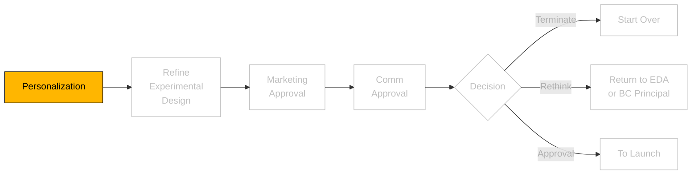
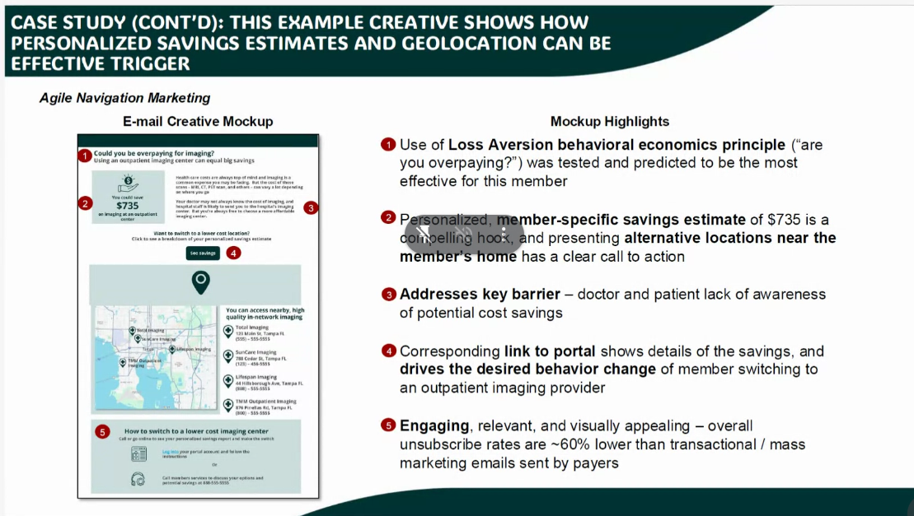
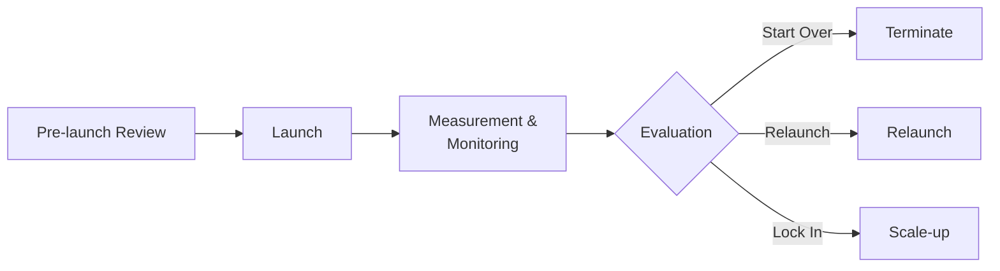

# Personalization

<figure>
<figcaption>Marketing Process</figcaption>



```js
///
// import some CSS to keep things well styled
import { defaultStyles } from "./components/styles.js";
const styleElement = html`<style>
  ${defaultStyles}
</style>`;

import { Microsite } from "./components/MicroSiteBuilder.js";
document.head.appendChild(styleElement);
```

```js
import {
  EmailComparisonView,
  CleanEmailView,
} from "./components/emailcomparison.js";
document.head.appendChild(styleElement);
```

## Email comparison Vierw

```js
view(EmailComparisonView());
```

```js
view(CleanEmailView());
```

## Org

Describe the process:

Let's mock up an email to link to this microsite.


TODO:

- not 'up to', you could save examctly
- Show it explicitly (average cost for you, average cost at x)
- show the email
- show the microsite
  - incremental microsite advantages are:
    1. show the math on the savings
    2. show the diversity and location of options, with math.
    3. show a boxplot

On demo website: first tab: pull up email. Second tab, experience on microsite. Default on landing, shown on exact 4 providers, with exact cost for precedure in question compared to average hospital cost for that procedure.

What about the historical look.
two cohorts maybe;

## Describe the flow

figure>

</figure>

<figure>
<figcaption>Figure 3: Launch and Scale Process</figcaption>



</figure>

## Microsite view

```js
const mapContainer = html`
  <style>
    .map-container {
      height: 450px;
      border-radius: 12px;
      overflow: hidden;
      box-shadow: 0 4px 12px rgba(0, 0, 0, 0.1);
    }
    .map-popup {
      font-family: var(--font-main);
      font-size: 14px;
    }
    .current-location-marker {
      display: flex;
      align-items: center;
      justify-content: center;
      background-color: #fee2e2;
      border-radius: 50%;
    }
    .alternative-location-marker {
      background-color: rgba(34, 197, 94, 0.2);
      border-radius: 50%;
    }
  </style>
  <div id="map-container" class="map-container"></div>
`;
```

```js
// Configuration file for Boston locations and cost data
const BOSTON_CONFIG = {
  mapCenter: {
    lat: 42.3601,
    lng: -71.0589,
    zoom: 14,
  },
  locations: {
    current: {
      name: "Massachusetts General Hospital",
      address: "55 Fruit Street, Boston, MA 02114",
      coordinates: { x: 400, y: 200 },
      cost: 1200,
      description: "Current imaging provider",
      phone: "(617) 726-2000",
      costDetails: {
        baseCost: 1200,
        withInsurance: 300,
        differential: "+300",
      },
    },
    alternatives: [
      {
        name: "CareWell Urgent Care - Downtown",
        address: "51 Commercial Street, Boston, MA 02109",
        coordinates: { x: 300, y: 150 },
        cost: 700,
        distance: 0.8,
        savings: 500,
        phone: "(617) 302-4194",
        description: "Urgent care facility with modern imaging equipment",
        costDetails: {
          baseCost: 700,
          withInsurance: 200,
          savings: 500,
        },
        availability: "Next Day",
      },
      {
        name: "Beth Israel Deaconess Medical Center Radiology",
        address: "330 Brookline Ave, Boston, MA 02215",
        coordinates: { x: 500, y: 250 },
        cost: 400,
        distance: 1.2,
        savings: 800,
        phone: "(617) 667-7000",
        description: "Full-service medical center radiology department",
        costDetails: {
          baseCost: 400,
          withInsurance: 100,
          savings: 800,
        },
        availability: "Same Week",
      },
    ],
  },
  streets: [
    {
      name: "Cambridge Street",
      path: "M 100 200 L 700 200",
      major: true,
    },
    {
      name: "Charles Street",
      path: "M 400 50 L 400 350",
      major: true,
    },
    {
      name: "Storrow Drive",
      path: "M 50 150 L 750 150",
      major: true,
    },
  ],
};
```

```js
let isMapInitialized = false;

function createBostonMap() {
  function addLeafletResources() {
    if (!document.querySelector('link[href*="leaflet.css"]')) {
      const css = document.createElement("link");
      css.rel = "stylesheet";
      css.href = "https://unpkg.com/leaflet@1.9.4/dist/leaflet.css";
      document.head.appendChild(css);
    }

    if (!document.querySelector('script[src*="leaflet.js"]')) {
      const script = document.createElement("script");
      script.src = "https://unpkg.com/leaflet@1.9.4/dist/leaflet.js";
      script.onload = () => {
        if (!isMapInitialized) {
          initMap();
        }
      };
      document.head.appendChild(script);
    } else if (!isMapInitialized) {
      initMap();
    }
  }

  function initMap() {
    const container = document.getElementById("map-container");
    if (!container || typeof L === "undefined" || isMapInitialized) return;

    // Set initialization flag
    isMapInitialized = true;

    const bostonLocations = {
      current: {
        ...BOSTON_CONFIG.locations.current,
        position: [42.3632, -71.0686],
      },
      alternatives: [
        {
          ...BOSTON_CONFIG.locations.alternatives[0],
          position: [42.3589, -71.0518],
        },
        {
          ...BOSTON_CONFIG.locations.alternatives[1],
          position: [42.3389, -71.1067],
        },
      ],
    };

    // Clear any existing map instance
    container.innerHTML = "";

    const map = L.map("map-container").setView(
      bostonLocations.current.position,
      14
    );

    L.tileLayer("https://{s}.tile.openstreetmap.org/{z}/{x}/{y}.png", {
      attribution: "© OpenStreetMap contributors",
      opacity: 0.5,
    }).addTo(map);

    // Icon for the current location (red circle with red dot center)
    const currentIcon = L.divIcon({
      html: `
        <div style="
          position: relative; 
          width: 24px; 
          height: 24px; 
          background-color: rgba(220, 38, 38, 0.5); 
          border-radius: 50%;
        ">
          <div style="
            position: absolute; 
            top: 50%; 
            left: 50%; 
            transform: translate(-50%, -50%); 
            width: 8px; 
            height: 8px; 
            // background-color: #dc2626; 
            border-radius: 50%;
          "></div>
        </div>
      `,
      className: "current-location-marker",
      iconSize: [24, 24],
    });

    // Icon for alternative locations (green circle)
    const alternativeIcon = L.divIcon({
      html: `
        <div style="
          width: 24px; 
          height: 24px; 
          background-color: rgba(34, 197, 94, 0.5); 
          border-radius: 50%;
        ">
        </div>
      `,
      className: "alternative-location-marker",
      iconSize: [24, 24],
    });

    // Add current location marker
    L.marker(bostonLocations.current.position, { icon: currentIcon })
      .bindPopup(
        `
        <div class="map-popup">
          <h3 style="color: #dc2626; margin: 0 0 8px 0">${bostonLocations.current.name}</h3>
          <p style="margin: 0 0 4px 0">${bostonLocations.current.address}</p>
          <p style="margin: 0 0 4px 0">${bostonLocations.current.phone}</p>
          <p style="margin: 0; color: #dc2626; font-weight: bold">
            $${bostonLocations.current.costDetails.differential} more expensive
          </p>
        </div>
      `
      )
      .addTo(map);

    // Add alternative location markers
    bostonLocations.alternatives.forEach((location) => {
      L.marker(location.position, { icon: alternativeIcon })
        .bindPopup(
          `
          <div class="map-popup">
            <h3 style="color: #22c55e; margin: 0 0 8px 0">${location.name}</h3>
            <p style="margin: 0 0 4px 0">${location.address}</p>
            <p style="margin: 0 0 4px 0">${location.phone}</p>
            <p style="margin: 0 0 4px 0; color: #22c55e; font-weight: bold">
              Save $${location.savings}
            </p>
            <p style="margin: 0">Available: ${location.availability}</p>
          </div>
        `
        )
        .addTo(map);
    });

    return map;
  }

  if (!isMapInitialized) {
    addLeafletResources();
  }
}
```

<style>
    :root {
        --primary-color: #1e40af;
        --secondary-color: #22c55e;
        --danger-color: #dc2626;
        --background-light: #f8fafc;
        --text-primary: #2c3e50;
        --text-secondary: #64748b;
        --shadow-sm: 0 2px 4px rgba(0,0,0,0.05);
        --shadow-md: 0 4px 12px rgba(0,0,0,0.1);
        --border-radius: 12px;
        --font-main: system-ui, -apple-system, sans-serif;
    }

    body {
        margin: 0;
        padding: 0;
        font-family: var(--font-main);
        color: var(--text-primary);
        background: white;
    }

    .microsite-container {
        max-width: 1200px;
        margin: 0 auto;
        padding: 20px;
    }

    .hero-section {
        display: grid;
        grid-template-columns: 1fr 1fr;
        gap: 40px;
        padding: 60px 20px;
        background: linear-gradient(to right, var(--background-light), #e2e8f0);
        border-radius: var(--border-radius);
        margin-bottom: 40px;
    }

    .hero-content h1 {
        font-size: 2.5em;
        color: var(--primary-color);
        margin-bottom: 20px;
    }

    .highlight {
        color: var(--danger-color);
        font-weight: 600;
    }

    .location-finder {
        background: white;
        padding: 30px;
        border-radius: var(--border-radius);
        box-shadow: var(--shadow-md);
    }

    input {
        width: 100%;
        padding: 12px;
        margin: 8px 0;
        border: 1px solid #cbd5e1;
        border-radius: 6px;
        font-size: 1.1em;
    }

    .search-button {
        width: 100%;
        padding: 12px;
        background: var(--primary-color);
        color: white;
        border: none;
        border-radius: 6px;
        font-size: 1.1em;
        cursor: pointer;
        transition: background 0.3s;
    }

.features-grid {
    display: grid;
    grid-template-columns: repeat(3, 1fr);
    gap: 20px;  /* reduced from 30px */
    margin-bottom: 20px;  /* reduced from 40px */
}


.feature-card {
    text-align: center;
    padding: 15px;  /* reduced from 30px */
    background: white;
    border-radius: var(--border-radius);
    box-shadow: var(--shadow-sm);
    transition: transform 0.3s;
}

.feature-icon {
    font-size: 1.5em;  /* reduced from 2em */
    margin-bottom: 10px;  /* reduced from 15px */
}

.feature-card h3 {
    margin: 5px 0;  /* added to reduce spacing */
    font-size: 1.1em;  /* reduced font size */
}

.feature-card p {
    margin: 5px 0;  /* reduced margin */
    font-size: 0.9em;  /* slightly smaller text */
}

    .map-section {
        margin-bottom: 40px;
    }

    .map-container {
        position: relative;
        width: 100%;
        height: 500px;
        background: white;
        border-radius: var(--border-radius);
        box-shadow: var(--shadow-md);
        overflow: hidden;
    }

    .location-cards {
        display: grid;
        grid-template-columns: repeat(auto-fit, minmax(300px, 1fr));
        gap: 20px;
        margin-bottom: 40px;
    }

    .location-card {
        padding: 20px;
        background: white;
        border-radius: var(--border-radius);
        box-shadow: var(--shadow-sm);
    }

    .savings-positive {
        color: var(--secondary-color);
        font-weight: 600;
    }

    .savings-negative {
        color: var(--danger-color);
        font-weight: 600;
    }

    .cost-comparison {
        padding: 40px;
        background: var(--background-light);
        border-radius: var(--border-radius);
        margin-bottom: 40px;
    }

    .cost-grid {
        display: grid;
        grid-template-columns: repeat(3, 1fr);
        gap: 20px;
    }

    .cost-card {
        background: white;
        padding: 20px;
        border-radius: var(--border-radius);
        text-align: center;
    }

    .price {
        font-size: 2em;
        color: var(--primary-color);
        margin: 10px 0;
    }

    .disclaimer {
        font-size: 0.8em;
        color: var(--text-secondary);
        text-align: center;
        padding: 20px;
    }

    @media (max-width: 768px) {
        .hero-section,
        .features-grid,
        .cost-grid {
            grid-template-columns: 1fr;
        }
    }
</style>

<div class="microsite-container">
<section class="hero-section">
<div class="hero-content">
    <h1>Save Up to <span class="highlight">$800</span> on Your COPD Imaging</h1>
    <p>You might be paying up to <span class="highlight">300%</span> more for your imaging at your current location. Find affordable alternatives in the Boston area.</p>
    <p>Most patients save an average of <span class="highlight">$650</span> by switching providers.</p>
</div>
<div class="location-finder">
    <h2>Find Affordable Imaging Centers</h2>
    <form id="location-form">
        <input type="text" id="zip" placeholder="Enter ZIP Code" value="02114"/>
        <input type="text" id="insurance" placeholder="Insurance Provider"/>
        <button type="submit" class="search-button">Find Nearby Centers</button>
    </form>
</div>
</section>

<!-- <section class="map-section"> -->
<div class="hero-content">
<h2>Find Affordable COPD Imaging Near You</h2>

```js
view(html` ${mapContainer} ${createBostonMap()} `);
```

<div class="cost-grid">
    <div class="cost-card">
        <h3>Current Cost</h3>
        <div class="price">$1,200</div>
        <div class="location">At MGH</div>
    </div>
    <div class="cost-card">
        <h3>Average Cost</h3>
        <div class="price">$900</div>
        <div class="location">Boston Area</div>
    </div>
    <div class="cost-card">
        <h3>Lowest Available</h3>
        <div class="price">$400</div>
        <div class="location">Beth Israel</div>
    </div>
</div>
</div>
</section>

<section class="location-cards">
<div class="location-card current">
    <h3>Current Location</h3>
    <h4>Massachusetts General Hospital</h4>
    <p>55 Fruit Street, Boston, MA 02114</p>
    <p class="phone">(617) 726-2000</p>
    <p class="savings-negative">$300 more than average cost</p>
    <p class="cost-detail">Total Cost: $1,200</p>
</div>

<div class="location-card alternative">
    <h3>Recommended Alternative</h3>
    <h4>CareWell Urgent Care - Downtown</h4>
    <p>51 Commercial Street, Boston, MA 02109</p>
    <p class="phone">(617) 302-4194</p>
    <p class="savings-positive">Save $500 on your next scan</p>
    <p class="distance">0.8 miles away</p>
    <p class="availability">Next Day Availability</p>
</div>

<div class="location-card alternative">
    <h3>Best Value Option</h3>
    <h4>Beth Israel Deaconess Medical Center</h4>
    <p>330 Brookline Ave, Boston, MA 02215</p>
    <p class="phone">(617) 667-7000</p>
    <p class="savings-positive">Save $800 on your next scan</p>
    <p class="distance">1.2 miles away</p>
    <p class="availability">Same Week Availability</p>
</div>
</section>

<footer class="disclaimer">
    <p>* Costs shown are estimates based on average insurance coverage. Actual costs may vary based on your specific insurance plan and coverage.</p>
    <p>** All alternative locations are fully accredited and meet the highest quality standards for medical imaging.</p>
</footer>
</div>

## Generic Microsite Builder

<!--
```js
const micrositeConfig = {
  defaultZip: '02114',
  heroSection: {
    title: 'Save Up to <span class="highlight">$800</span> on Your COPD Imaging',
    subtitle:
      'You might be paying up to <span class="highlight">300%</span> more for your imaging at your current location.',
    highlights: 'Most patients save an average of <span class="highlight">$650</span> by switching providers.',
  },
  mapSectionTitle: 'Find Affordable COPD Imaging Near You',
  mapCenter: {
    lat: 42.3601,
    lng: -71.0589,
    zoom: 14,
  },
  locations: {
    current: {
      name: 'Massachusetts General Hospital',
      address: '55 Fruit Street, Boston, MA 02114',
      position: [42.3632, -71.0686],
      cost: 1200,
      description: 'Current imaging provider',
      phone: '(617) 726-2000',
      costDetails: {
        baseCost: 1200,
        withInsurance: 300,
        differential: '+300',
      },
    },
    alternatives: [
      {
        name: 'CareWell Urgent Care - Downtown',
        address: '51 Commercial Street, Boston, MA 02109',
        position: [42.3589, -71.0518],
        cost: 700,
        distance: 0.8,
        savings: 500,
        phone: '(617) 302-4194',
        description: 'Urgent care facility with modern imaging equipment',
        costDetails: {
          baseCost: 700,
          withInsurance: 200,
          savings: 500,
        },
        availability: 'Next Day Availability',
      },
      {
        name: 'Beth Israel Deaconess Medical Center Radiology',
        address: '330 Brookline Ave, Boston, MA 02215',
        position: [42.3389, -71.1067],
        cost: 400,
        distance: 1.2,
        savings: 800,
        phone: '(617) 667-7000',
        description: 'Full-service medical center radiology department',
        costDetails: {
          baseCost: 400,
          withInsurance: 100,
          savings: 800,
        },
        availability: 'Same Week Availability',
      },
    ],
  },
  costGrid: [
    {
      title: 'Current Cost',
      price: '$1,200',
      location: 'At MGH',
    },
    {
      title: 'Average Cost',
      price: '$900',
      location: 'Boston Area',
    },
    {
      title: 'Lowest Available',
      price: '$400',
      location: 'Beth Israel',
    },
  ],
  disclaimer: `
    <p>* Costs shown are estimates based on average insurance coverage. Actual costs may vary based on your specific insurance plan and coverage.</p>
    <p>** All alternative locations are fully accredited and meet the highest quality standards for medical imaging.</p>
  `,
};

```


<div class="microsite-container"></div>

```js


  const containerDD = document.querySelector(".microsite-container");
  const microsite = new Microsite(micrositeConfig);
  microsite.initialize(containerDD);

```

```js
view(containerDD)
```
</div> -->
