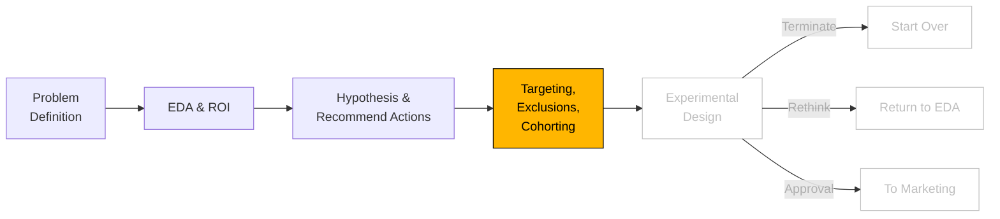

# Targeting & Exclusions

```js
// import some CSS to keep things well styled
import { defaultStyles } from "./components/styles.js";
const styleElement = html`<style>
  ${defaultStyles}
</style>`;
document.head.appendChild(styleElement);
```



```js
import { require } from "d3-require";
```

```js
// import data gen and consts
import {
  generateHealthcareData,
  CONSTANTS,
  calculateImageUse,
} from "./components/generateHealthcareData.js";
import {
  prepareImagingData,
  stratifiedSubsample,
  getRandomSubsample,
  computeMeanAndCI,
  computeROC,
} from "./components/ml-utils.js";
import { FunnelChart } from "./components/FunnelChart.js";

import {
  createTreeWithStats,
  calculateStats,
  createFunnelData,
  formatNumber,
} from "./components/TreeExplore.js";

import {
  createMulticlassMetric,
  createRateMetric,
  createDemographicMetrics,
  aggregateData,
  createDataSummary,
  createIntMetric,
  createFloatMetric,
} from "./components/AggStats.js";
import { createSankeyFlow } from "./components/SankeyFlow.js";
import { RandomForestClassifier } from "./components/RandomForestClassifier.js";
```

```js
// imports

import {
  TableInput,
  TableInputTypes,
  EVENTS,
  LiveTable,
  LiveTableData,
} from "./components/LiveTable.js";

import * as d3 from "https://cdn.jsdelivr.net/npm/d3@7/+esm";
import { require } from "d3-require";
const jStat = await require("jstat@1.9.4");
const math = await require("mathjs@9.4.2");

// it's 'noisy' when we have so much CSS in the page
import { defaultStyles } from "./components/styles.js";
const styleElement = html`<style>
  ${defaultStyles}
</style>`;
document.head.appendChild(styleElement);
```

```js
const data = [
  {
    group: "Systems Development",
    value: 100.0,
    altValue: "2,854 users",
  },
  {
    group: "Operations",
    value: 88.6,
    altValue: "2,528 users",
  },
  {
    group: "Web Infrastructure",
    value: 51.1,
    altValue: "1,458 users",
  },
  {
    group: "IT Infrastructure",
    value: 39.9,
    altValue: "1,139 users",
  },
  {
    group: "Systems",
    value: 27.4,
    altValue: "782 users",
  },
  {
    group: "Non-IT/Systems",
    value: 21.8,
    altValue: "622 users",
  },
];

const rates = [
  "conversion rate: 88.6% ",
  "adoption rate: 57.7%",
  "implementation rate: 78.1%",
  "integration rate: 68.7%",
  "utilization rate: 79.6%",
  "",
];

// Create chart with rates
const chart = FunnelChart(data, rates, {
  margin: { top: 40, right: 40, bottom: 40, left: 250 },
  labels: {
    includePercentage: true,
    useAltValue: true, // This will use altValue instead of percentage in labels
    offset: { x: -20 },
  },
  percentages: {
    show: true,
    offset: { x: 0, y: 0 },
  },
  rates: {
    leftAligned: true,
    offset: { x: -10 },
  },
});

view(chart);
```
