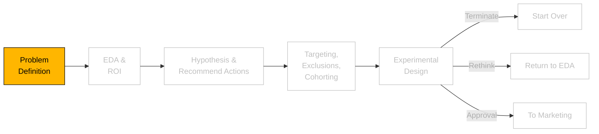

```js
// import some CSS to keep things well styled
import { defaultStyles } from "./components/styles.js";
const styleElement = html`<style>
  ${defaultStyles}
</style>`;
document.head.appendChild(styleElement);
```

```js
import { InteractiveImagingExplorer } from "./components/interactiveimagingexample.js";
import { DistP, distributions } from "./components/DistP.js";
import * as d3 from "https://cdn.jsdelivr.net/npm/d3@7/+esm";
```

# Problem Definition



### What is `preferred` vs `non-preferred` imaging? What types of imaging are there?

```js
view(InteractiveImagingExplorer());
```

### Why `preferred` Imaging Locations?

Opting for **preferred (in-network) imaging locations** benefits both payers and members:

- **For Members**: Lower out-of-pocket costs due to negotiated rates with in-network providers. Members also avoid unexpected billing surprises and benefit from streamlined approval and claims processes.

- **For Payers**: Reduced costs by leveraging pre-negotiated contracts with in-network providers. This promotes predictable spending, reduces administrative burden, and helps maintain lower premiums for members.

Encouraging preferred imaging usage aligns financial incentives, improves member satisfaction, and supports sustainable healthcare costs.
